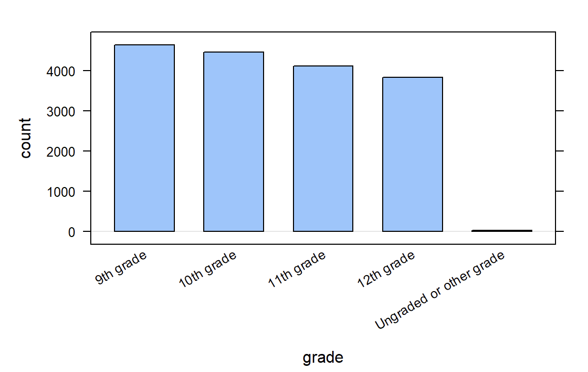
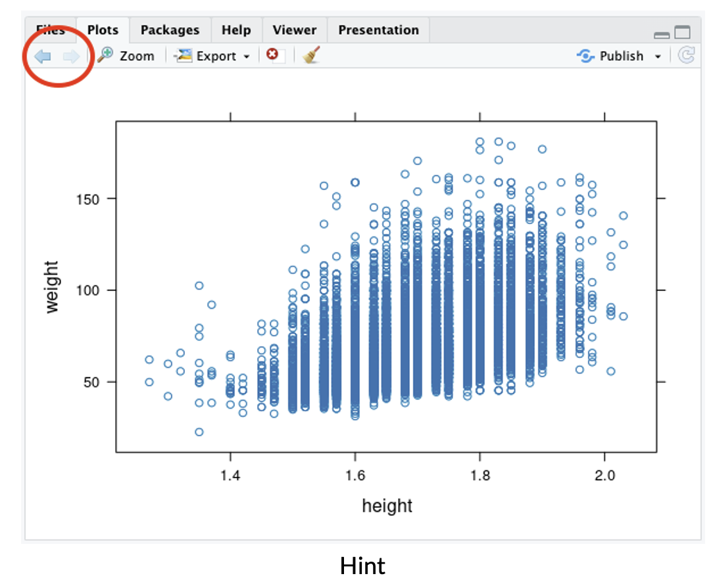

##**<u>Lab 1A - Data, Code & RStudio</u>**

Directions: Follow along with the slides, completing the questions in <span style="color:midnightblue;">**blue**</span> on your computer, and answering the questions in <span style="color:firebrick;">**red**</span> in your journal.

###**Welcome to the labs!**

* Throughout the year, you'll be putting your data science skills to work by completing the labs.

* You'll learn how to program in the ```R``` programming language.

    – The programming language used by actual data scientists.

* Your code will be written in RStudio which is an easy to use interface for coding using ```R```.

###**So let's get started!**

* The data for our first few labs comes from the Centers for Disease Control (CDC).

    – The CDC is a federal institution that studies public health.

* <span style="color:midnightblue;">**Type these two commands into your console:**</span>

        data(cdc)
        View(cdc)


* <span style="color:firebrick;">**Describe the data that appeared after running ```View(cdc)```:**</span>

    – <span style="color:firebrick;">**(1) *Who* is the information about?**</span>

    – <span style="color:firebrick;">**(2) What sorts of information about them was collected?**</span>

* To find out more information about the ```cdc``` data, type the command below into your console.

    – To get back to the slides find and click on the *Viewer* tab.

        ?cdc

###**Data: Variables & Observations**

* Data can be broken up into two parts.

    `1. *Observations*

    `2. *Variables*

    – *Observations* are the *who* or *what* we are collecting data from/about.

    – *Variables* are the measurements or characteristics about our *observations*.

* If need be, re-type the command you used to ```View``` your data. Then answer the following:

    – <span style="color:firebrick;">**(3) Based on the data, describe a few characteristics about the first observation.**</span>

    – <span style="color:firebrick;">**(4) What does the first column tell us about our observations?**</span>

* In order to describe the first observation, notice that you had to look at the first row of the spreadsheet. Each row, in this case, describes a person.

* The columns of the spreadsheet represent variables.

###**Uncovering our Data's Structure**

* Now that we've looked at our data, let's look at how RStudio is organized.

* RStudio's main window is composed of four *panes*

* <span style="color:midnightblue;">**Find the pane that has a *tab* titled *Environment* and click on the *tab*.**</span>

    – This pane contains a list of everything that's currently available for ```R``` to use.

    – Notice that ```R``` knows we have our ```cdc``` data loaded.

* <span style="color:firebrick;">**(5) How many students are in our ```cdc``` dataset?**</span>

* <span style="color:firebrick;">**(6) How many variables were measured for each student?**</span>

###**Some New Functions**

* <span style="color:midnightblue;">**Type the following commands into the console:**</span>

        dim(cdc)
        nrow(cdc)
        ncol(cdc)
        names(cdc)

* <span style="color:firebrick;">**(7) Which of these functions tell us the number of observations in our data?**</span>

* <span style="color:firebrick;">**(8) Which of these functions tell us the number of variables?**</span>

###**First Steps**

* Typing commands into the console is your first step into the larger world of *programming* or
*coding* (terms which are often used interchangeably).

* Coding is all about learning how to send instructions to your computer.

    – The way we *speak* to the computer, using a coding language, is *syntax*.

* ```R``` is one of many coding languages. Each coding language is slightly different, and these differences are reflected in the syntax.    

* *Capitalization*, *spelling* and *punctuation* are REALLY important.

###**Syntax matters**

* <span style="color:midnightblue;">**Run the following commands.**</span>

        Names(cdc)
        NAMES(cdc)
        names(cdc)
        names(CDC)

* <span style="color:firebrick;">**(9) What happens after each command?** </span>

* <span style="color:firebrick;">**(10) Which does ```R``` understand?**</span>

###**R's most important syntax**

* Most of the commands you will be using follow the syntax below.

        function (y ~ x, data = ____ )

* To create graphs or plots you need to provide ```R``` with the following:

    – The name of the ```R``` function, often the plot’s name, that tells the computer how to create your graph.

    - The variable(s) containing the information we want the function to use.

    - The dataset containing the variables.

* Notice that when we analyze a single variable the value for *y* is left blank.

        bargraph(~grade, data = cdc)



* Later on, we’ll see we can use this syntax to do more than create graphs.

###**Syntax in action**

* <span style="color:midnightblue;">**Search through the different panes. Find and then click on the *Plots* tab.**</span>

    - To get back to the slides, find and then click on the *Viewer* tab.

* <span style="color:firebrick;">**(11) Would a histogram, bargraph, or scatterplot be useful for answering the question: *Is it unusual for students in the CDC dataset to be taller than 1.8 meters?* **</span>

* <span style="color:midnightblue;">**Run the three commands below then answer the question that follows.**</span>

        histogram(~height, data = cdc)

        bargraph(~height, data = cdc)

        xyplot(weight~height, data = cdc)

* <span style="color:firebrick;">**(12) Do you think it’s unusual for students in the ```cdc``` dataset to be taller than 1.8 meters? Why or why not?**</span>

* Hint: Use the arrow keys on the *Plots* tab to toggle between the plots.



###**On your own:**

* After completing the lab, answer the following questions:

    – <span style="color:firebrick;">**(13) What is *public health* and do we collect data about it?**</span>

    – <span style="color:firebrick;">**(14) How do you think our data was collected? Does it include every high school aged student in the US?** </span>

    – <span style="color:firebrick;">**(15) How might the CDC use this data? Who else could benefit from using this data?**</span>

    – <span style="color:firebrick;">**(16) Write and run the code to visualize the distribution of weights of the students in the CDC data with a ```histogram```. What is the *typical* weight?**</span>

    – <span style="color:firebrick;">**(17) Write and run the code to create a ```bargraph``` to visualize the distribution of how often students ate fruit. About how many students did not eat fruit over the previous 7 days?**</span>