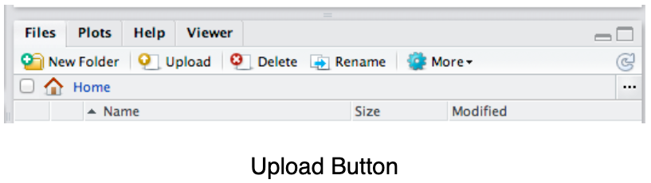
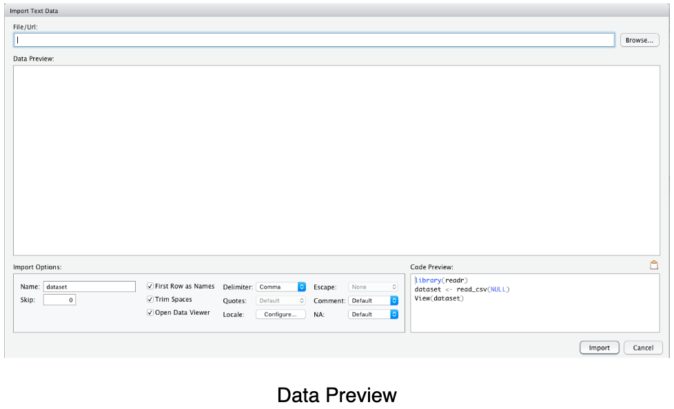

###
Directions: Follow along with the slides, completing the questions in <span style="color:midnightblue;">**blue**</span> on your computer, and answering the questions in <span style="color:firebrick;">**red**</span> in your journal.

###**Whose data? Our data.**
* Throughout the previous labs, we've been using data that was already loaded in RStudio.

    – But what if we want to analyze our own data?
    
* This lab is all about learning how to load our own participatory sensing data into RStudio.

###**Export, upload, import**
* Before we can perform any analysis, we have to load data into ```R```.

* When we want to get our participatory sensing data into RStudio, we:

    – <span style="color:darkgreen;">Export</span> the data from your class’ campaign page.

    – <span style="color:darkgreen;">Upload</span> data to *RStudio* server

    – <span style="color:darkgreen;">Import</span> the data into R's working memory

    * *Note: You can watch the following video for a step-by-step walk-through of the process:*
    <div align="right"><iframe width="560" height="315"
    src="https://www.youtube.com/embed/4mChtv5qy1g" allowfullscreen>
    </iframe><br><a href="https://www.youtube.com/embed/4mChtv5qy1g">https://www.youtube.com/embed/4mChtv5qy1g</a></div>

###**Exporting**
* <span style="color:midnightblue;">**To begin, go to the IDS Tools page**</span>

    – <span style="color:midnightblue;">**Click on the</span> <span style="color:darkgreen;">Campaign Manager**</span>

    – <span style="color:midnightblue;">**Fill in your username and password and click "Sign in".**</span>

    

    If you forget your username or password, ask your teacher to remind you.

###**Campaign Manager**


* After logging in, your screen should look similar to this.

* <span style="color:midnightblue;">**Click on the dropdown arrow for the campaign you are interested in downloading.**</span>

    – At this point in the course, it will most likely be the Food Habits campaign.

###**Dropdown Arrow**
* The options for the dropdown menu will look like this:

    

* <span style="color:midnightblue;">**Click on the option labeled</span> <span style="color:darkgreen;">Export Data.**</span>

    – Remember where you save your file!

###**Exporting**
* When you clicked the <span style="color:darkgreen;">Export</span> link, a *.csv* file was saved on your computer.

* Now that the file is on your computer, we need to <span style="color:darkgreen;">upload</span> it into RStudio.

###**Uploading**
* <span style="color:midnightblue;">**Look at the four different *panes* in RStudio.**</span>

    – <span style="color:midnightblue;">**Find the *pane* with a</span> <span style="color:darkgreen;">Files</span> <span style="color:midnightblue;">tab.**</span>

    – <span style="color:midnightblue;">**Click it!**</span>

    

* <span style="color:midnightblue;">**Click the button on the Files pane that says "Upload".**</span>

    – <span style="color:midnightblue;">**Click on "Choose File" and find the *SurveyResponses.csv* file you saved to your computer.**</span>

    – <span style="color:midnightblue;">**Hit the *OK* button.**</span>

* Voila!

    – If you look in the <span style="color:darkgreen;">Files</span> pane, you should be able to find your data!

###**Upload vs. Import**
* By <span style="color:darkgreen;">Uploading</span> your data into RStudio you've really only given yourself access to it.

    – Don't believe me? Look at the <span style="color:darkgreen;">Environment</span> pane ... where's your data?

* To actually use the data we need to <span style="color:darkgreen;">Import</span> it into your computer's memory.

* To compute more quickly and efficiently, ```R``` will only keep a few data sets stored in its memory at a time.

    – By importing data, you are telling ```R``` that this is a data set that is important to store it in its memory so you can use it.

###**Importing**


* <span style="color:midnightblue;">**On the Files pane, find the data you want to</span> <span style="color:darkgreen;">import</span><span style="color:midnightblue;">.**</span>

* <span style="color:midnightblue;">**Click on the name of the file and choose the option "Import Data set..."**</span>

###**Data Preview**



* You can give your data a name using the <span style="color:darkgreen;">Name:</span> field in the lower left corner.

###**What's in a name?**
* The name you give your data is what you will use when you write code to analyze your data.

    – Good names are short and descriptive.

    – For your food habits campaign, some good names to use would be "foodhabits" or even just "food".

* When you're ready, click the *Import* button.

###**read.csv()**

* After you click *Import* you might notice something appeared in your console.

        data.file <- read_csv("~/SurveyResponse.csv")
        View(data.file)

* This is the actual code ```RStudio``` uses to read your data when you clicked the *Import* button.

    – So instead of using the ```RStudio``` buttons, we can actually <span style="color:darkgreen;">Import</span> by writing code similar to what was output into the console!

    – This will come in handy later in the course.

###**A word on staying organized...**


* The <span style="color:darkgreen;">Files</span> tab has a few other features to help keep you organized.

    – *SurveyResponse* probably isn't the best name for your data. Click <span style="color:darkgreen;">Rename</span> to give it a clearer name.

    – Often, it’s helpful to give your data file the same name as when you import your data.

    – So in this case, we could name our data file *food.csv*.

###**Analysis Time**

* After you <span style="color:darkgreen;">Export</span>, <span style="color:darkgreen;">Upload</span>, <span style="color:darkgreen;">Import</span> your data, you're ready to analyze.

* <span style="color:midnightblue;">**```View``` your data, then select a variable and try to make an appropriate plot for that variable.**</span>