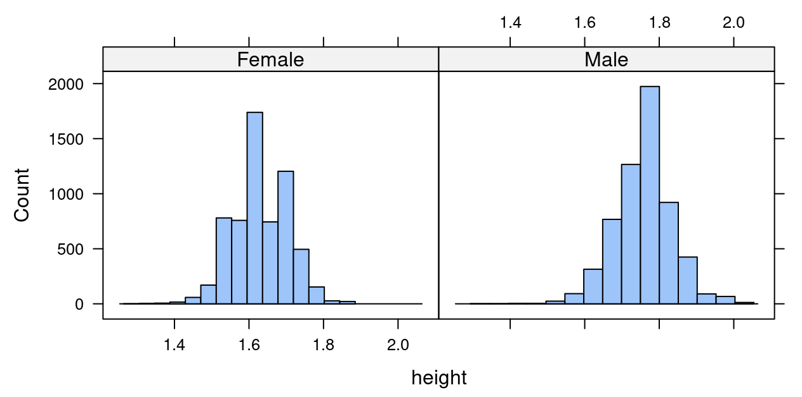

##**<u>Lab 1E - What's the Relationship?</u>**

Directions: Follow along with the slides, completing the questions in <span style="color:midnightblue;">**blue**</span> on your computer, and answering the questions in <span style="color:firebrick;">**red**</span> in your journal.

###**Finding patterns in data.**
* To discover (*really*) interesting observations or relationships in data, we need to find them!

    – Which is difficult if we only look at the raw data.

* The best tool for finding patterns is often ... your own eyes.

    – Plots are an excellent way to help your eye search for patterns.

* In this lab, we'll learn how to include more variables in our plots to make them more informative.

* Import the data from your class' *Food Habits* campaign and name it ```food```.

###**Where's the variables?**



* <span style="color:firebrick;">**How many variables were used to create this plot? Which variables were used and how were they used?**</span>

###**Multiple variable plots**
* The previous graph is an example of a *multiple variable plot*, which means that more than a single variable was used. In this case:

* Variable 1: *height*

* Variable 2: *sex*

* Multiple variable plots are tools for finding *relationships* between data.

* Let's take our ```food``` data and make some new multiple variable plots you haven't created before!

###**Scatterplots**

* Scatterplots are useful for viewing how one *numerical* variable relates to another *numerical* variable.


###**Creating scatterplots**

* <span style="color:midnightblue;">**Fill in the blanks to create a scatterplot with ```sodium``` on the y-axis and ```sugar``` on the x-axis.**</span>

        xyplot(____ ~ ____, data = food)

###**Scatterplots in action**
* <span style="color:midnightblue;">**Use a scatterplot to answer the following questions:**</span>

    – <span style="color:firebrick;">**Do snacks that have more ```protein``` also have more ```calories```? Why do you think that?**</span>

    – <span style="color:firebrick;">**What happens if you swap the ```protein``` and ```calories``` variables in your code? Does the relationship between the variables change?**</span>

    – <span style="color:firebrick;">**Does the relationship between ```protein``` and ```calories``` change when the snack is either ```Salty``` or ```Sweet```? Write down the code you used to answer this question.**</span>

###**4-variable scatterplots**
* When we make scatterplots, we can include:

    – 1 numerical variable on the x-axis

    – 1 numerical variable on the y-axis

    – Use 1 categorical variable to facet our scatterplot

    – Change the color of the points based on another categorical variable

* To change the color of our points, we can include the ```groups``` argument much like we did for bargraphs (use the *search* feature in the *History* pane if you need help).

* <span style="color:midnightblue;">**Create a scatterplot that uses these 4 variables: ```sodium```, ```sugar```, ```cost```, ```salty_sweet```.**</span>

###**Multiple facets**
* It can sometimes be helpful to facet on more than 1 variable.

    – Splitting the data using 2 facets can give us additional insights that might otherwise be hidden.

* <span style="color:midnightblue;">**Create a ```dotPlot``` or ```histogram``` of the ```calories``` variable, but facet the data using:**</span>

        healthy_level + salty_sweet

* <span style="color:firebrick;">**How does the ```healthy_level``` of a ```Salty``` or ```Sweet``` snack impact the number of ```calories``` in the snack?**</span>

* Although we are treating ```healthy_level``` as a categorical variable, ```R``` recongizes it as a numerical variable.

    – <span style="color:midnightblue;">**Verify this using the *str* function.**</span>

    – Notice that the faceted histograms or dotPlots do not have labels but rather tick-marks.

    – You will have the opportunity to convert the ```healthy_level``` variable into a factor later on.

* Faceting your data on a numerical variable is NOT recommended.

    – Numerical variables often have so many different values that they overwhelm the plot and make it hard to read.

###**On your own**
* <span style="color:midnightblue;">**Answer the following questions by creating an appropriate graph or graphs:**</span>

    – <span style="color:firebrick;">**Do healthier snacks have more or less ```ingredients``` than less healthy snacks?**</span>

    – <span style="color:firebrick;">**What other variables seem to be related to the number of ```ingredients``` of a snack? Describe their relationships.**</span>