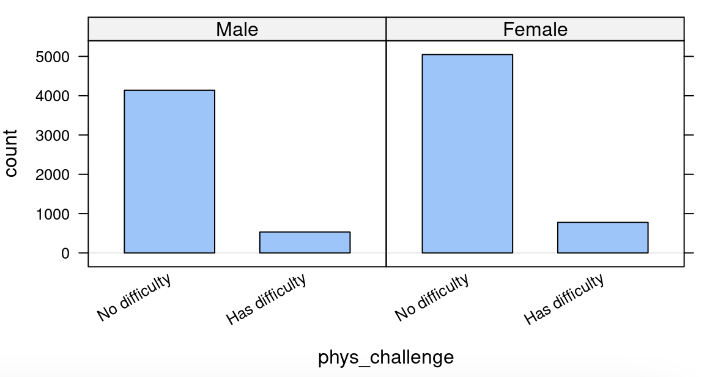

##**<u>Lab 1G - What's the FREQ?</u>**

Directions: Follow along with the slides, completing the questions in <span style="color:midnightblue;">**blue**</span> on your computer, and answering the questions in <span style="color:firebrick;">**red**</span> in your journal.

###**Clean it up!**
* In [Lab 1F](lab1f.md), we saw how we could *clean* data to make it easier to use and analyze.

    – You cleaned a small set of variables from the American Time Use (ATU) survey.

    – The process of cleaning and then analyzing data is *very* common in Data Science.

* In this lab, we'll learn how we can create frequency tables to detect relationships between categorical variables.

    – <span style="color:midnightblue;">**For the sake of consistency, rather than using the data that you cleaned, you will use the pre-loaded ATU data.**</span>

    – <span style="color:midnightblue;">**Use the ```data()``` function to load the ```atu_clean``` data file to use in this lab.**</span>

###**How do we summarize categorical variables?**
* When we're dealing with categorical variables, we can't just calculate an **average** to describe a *typical* value.

    – (Honestly, what's the average of categories *orange*, *apple* and *banana*, for instance?)
    
* When trying to describe categorical variables with numbers, we calculate **frequency tables**

###**Frequency tables?**
* When it comes to categories, about all you can do is *count* or *tally* how often each category comes up in the data.

* <span style="color:firebrick;">**Fill in the blanks below to answer the following: How many more *females* than *males* are there in our ATU data?**</span>

        tally(~ ____, data = ____)

###**2-way Frequency Tables**
* Counting the categories of a single variable is nice, but often times we want to make comparisons.

* For example, what if we wanted to answer the question:

    – Does one ```gender``` seem to have a higher occurrence of physical challenges than the other?

* We could use the following plot to try and answer this question:

        bargraph(~phys_challenge | gender, data = atu_clean)



* The split ```bargraph``` helps us get an idea of the answer to the question, but we need to provide precise values.

* <span style="color:midnightblue;">**Use a line of code, that’s similar to how we facet plots, to obtain a ```tally``` of the number of people with physical challenges and their genders.**</span>

    - <span style="color:firebrick;">**Write down the resulting table.**</span>

###**Interpreting 2-way frequency tables**
* Recall that there were 1153 more women than men in our data set.

    – If there are more women, then we might expect women to have more physical challenges (compared to men).

* Instead of using *counts* we use *percentages*.

* <span style="color:midnightblue;">**Include: ```format = "percent"``` as an option to the code you used to make your 2-way frequency table.**</span>

    – <span style="color:firebrick;">**Does one ```gender``` seem to have a higher occurrence of physical challenges than the other? If so, which one and explain your reasoning?**</span>

* It’s often helpful to display totals in our 2-way frequency tables.

    – To include them, include ```margins = TRUE``` as an option in the ```tally``` function.

###**Conditional Relative Frequencies**
* There is as difference between ```phys_challenge | gender``` and ```gender | phys_challenge```!

        tally(~phys_challenge | gender, data = atu_clean, margin = TRUE)

        ##                 gender
        ## phys_challenge   Male Female
        ##   No difficulty  4140   5048
        ##   Has difficulty  530    775
        ##   Total          4670   5823

        tally(~gender | phys_challenge, data = atu_clean, margin = TRUE)

        ##         phys_challenge
        ## gender   No difficulty Has difficulty
        ##   Male            4140            530
        ##   Female          5048            775
        ##   Total           9188           1305

###**Conditional Relative Frequencies, continued**
* At first glance, the two-way frequency tables might look similar (especially when the ```margin``` option is excluded). Notice, however, that the totals are different.

* The totals are telling us that ```R``` calculates conditional frequencies by column!

* What does this mean?        

    – In the first two-way frequency table the groups being compared are ```Male``` and ```Female``` on the distribution of physical challenges.

    – In the second two-way frequency table the groups being compared are the people with ```No difficulty``` and those that ```Has difficulty``` on the distribution of gender.

* <span style="color:firebrick;">**Add the option ```format = "percent"``` to the first ```tally``` function. How were the percents calculated? Interpret what they mean.**</span>

###**On your own**
* <span style="color:firebrick;">**Describe what happens if you create a 2-way frequency table with a numerical variable and a categorical variable.**</span>

* <span style="color:firebrick;">**How are the types of statistical investigative questions that 2-way frequency tables can answer different than 1-way frequency tables?**</span>

* <span style="color:firebrick;">**Which ```gender``` has a higher rate of *part time employment*?**</span>