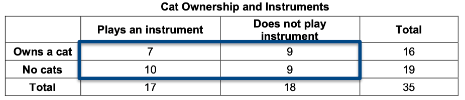
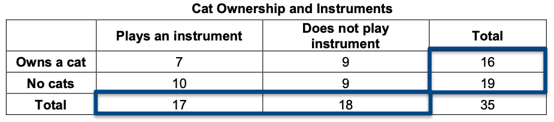
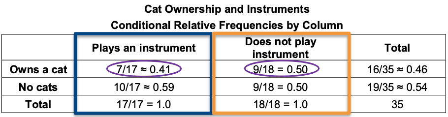

##**<u>Lesson 17: Interpreting Two-Way Tables</u>**

###**Objective:**
Students will calculate conditional, marginal, and joint frequencies and explain what they mean in the
context of the data.

###**Materials:**
1. Poster paper

2. Markers

3. *Analyzing Categorical Variables* ([LMR_U1_L17_A](../IDS_Curriculum_v_5.0/2_IDS_LMRs_v_6.0/IDS_LMR_Unit 1_v_6.0/LMR_U1_L17_A.pdf))

    **Advance preparation required** Needs to be cut into sets (see step 23 in lesson)

4. *Interpreting Categorical Variables* ([LMR_U1_L17_B](../IDS_Curriculum_v_5.0/2_IDS_LMRs_v_6.0/IDS_LMR_Unit 1_v_6.0/LMR_U1_L17_B.pdf))

###**Vocabulary:**
[marginal frequency](../../vocabulary/unit1/#marginal (relative) frequency "the margins on the table that show the cells with the initial total counts"){ .md-button }
[joint frequency](../../vocabulary/unit1/#joint (relative) frequency "a fraction that tells you how many members of a group havea  particular characteristic"){ .md-button }
[conditional relative frequency](../../vocabulary/unit1/#conditional relative frequency "the ratio of a joint relative frequency and related marginal relative frequency"){ .md-button }

###**Essential Concepts:**

!!! note "Essential Concepts: "
    Marginal (relative) frequencies tell us about the distribution of a single variable.
    Conditional relative frequencies tell us about the distribution of one variable when "subsetting" the other.

###**Lesson:**
1. **<u>Time Use Campaign Data Collection Monitoring:</u>**

    100. Display the IDS Campaign Monitoring Tool, found at 
    [https://portal.idsucla.org](https://portal.idsucla.org "https://portal.idsucla.org"){:target="_blank"} 
    Click on **Campaign Monitor** and sign in.

    100. Inform students that you will be monitoring their data collection again today.

        200. See *User List* and sort by *Total*. Ask: Who has collected the most data so far?

        200. Click on the pie chart. Ask: How many active users are there? How many inactive
        users are there?

        200. See *Total Responses*. How many responses have been submitted?
        
        200. Using TPS, ask students to think about what can they do to increase their data
        collection.
        
    100. Remind students that this is the last day to collect data.

2. Ask student teams to take out the 2 questions and the two-way table that they created in the
previous day’s lesson.

3. Before teams ask the class their questions, ask them to strategize about how they will collect and
record their data, because they can only ask the 2 questions.

4. Students in the class will respond to each question by raising their hands.

5. In a *Whip Around*, have each team ask their 2 questions. Pause briefly between teams so that the
asking team has time to collect and record their data.

6. Students will use their frequency tables before the end of the lesson.

7. Recall that in the previous lesson, students learned to calculate relative frequencies.

8. Display the *Cat Ownership and Instruments* table:

    **Cat Ownership and Instruments**

    |  | **Plays an instrument** | **Does not play instrument** | **Total** |
    | ------------ | ------------- | ------------ | ------------ |
    | **Owns a cat** | 7 | 9 | 16 |
    | **No cats** | 10 | 9 | 19 |
    | **Total** | 17 | 18 | 35 |

9. Suppose that we want to know the following information (display questions):

    100. How many students own a cat and play an instrument? ***Answer: 7***

    100. What is the proportion of students who own a cat and play an instrument? ***Answer: 7/35 = 0.2***

    100. What is the proportion of students who do not own a cat and do not play an instrument? ***Answer: 9/35 ≈ 0.257***

10. In teams, discuss where on the table you would find this information and how you would calculate
it. The questions should look familiar because they are the same type of questions asked in the previous lesson. The specific answers are not important; but what is important is to know how to obtain the
information. ***Possible answer: You would find the answers in the cells that make
up the body of the table.***

11. After a few minutes, ask a team to volunteer a response. Mark up the cells in the body of the table to show that the cells with the initial counts are called **joint frequencies**, like in 91. When you take the value of each cell over the total number of observations (the proportion), these are the ***joint relative frequencies***, like in 9b and c. ***See example:***

12. There are multiple types of relative frequencies. Let's look at other ways of understanding a two-way frequency table using another type of relative frequency.

13. Suppose that we want to know the following information (display questions):

    100. How many students own a cat? ***Answer: 16***

    100. What is the proportion of students who own a cat? ***Answer: 16/35 ≈ 0.46***

    100. What is the proportion of students who do not play an instrument? ***Answer: 18/35 ≈
    0.51***

14. In teams, discuss where on the table you would find this information and how you would calculate
it. The specific answers are not important; but what is important is to know how to obtain the
information. ***Possible answer: You would find the proportion of students who do not play an instrument by dividing the number in the "Total" row that is in the "Does not play instrument" column by the total number of students (35).***

15. After a few minutes, ask a team to volunteer a response. Mark up the margins on the table to show that the cells with the initial total counts are called **marginal frequencies**, like in 13a. When you take the total of each row (or column) over the total number of observations, these are the ***marginal relative frequencies***, like in 13b and c. ***See example:***

16. Suppose that we wanted to answer the question: Of the students who play an instrument, what proportion own a cat?

17. In teams, discuss where on the table you would find this information and how you would calculate
it. The specific answers are not important; but what is important is to know how to obtain the
information. ***Possible answer: You would first find the "Total" number of students who play an instrument (17). Then, to find the proportion of those students who own a cat, you would look at how many students own a cat within that column (7) and divide it by the "Total" who "Plays an instrument" (7/17).***

18. After a few minutes, ask a team to volunteer a response. Encourage students to agree or
disagree with the explanations provided. Lead students to see that the total for the “Plays an isntrument” column is important because we are only concerned with that subset of the group. Mark up the "Plays an instrument" column on the table to show that we have conditioned, or are bound, by this variable. This is a ***conditional relative frequency*** by *column*.

19. Finally, suppose that we wanted to answer the question: Do a greater proportion of students in Rosa's art class who do not play an instrument own a cat than those who do play an instrument?

20. In teams, discuss where on the table you would find this information and how you would calculate it. The specific answers are not important; but what is important is to know how to obtain the information. ***Possible answer: You would need to find an additional proportion. You would first find the "Total" number of students who do not play an instrument (18). Then, to find the proportion of those students who own a cat, you would look at how many students own a cat within that column (9) and divide it by the "Total" who "Does not play an instrument" (9/18).***

21. After a few minutes, ask a team to volunteer a response. Encourage students to agree or disagree with the explanations provided. Lead students to see that the total for the "Does not play instrument" column is important because we are now also concerned with that subset of the group. Mark up the "Does not play instrument" column on the table to show that we have conditioned, or are bound, by this variable. Compare the values that show the ***conditional relative frequency*** for each *column*, "Does not play instrument" and "Plays an instrument". A higher proportion of students who do not play an instrument own a cat than students who do play an instrument.

**Note:** These are conditional relative frequency by column. We can also calculate conditional relative frequencies by row if we were interested in knowing the difference in playing an instrument for those who own cats versus those who do not.

22. Was Rosa right? ***Answer: Looking back at our scenario introduced in the last lesson, "Rosa has a theory that musicians are more likely to own a cat," our analysis in steps 19-21 above does not provide evidence to support her theory. We found that a higher proportion of students who do not play an instrument own a cat than students who do play an instrument.***

23. Distribute one full set of cards from the *Analyzing Categorical Variables* file ([LMR_U1_L17_A](../IDS_Curriculum_v_5.0/2_IDS_LMRs_v_6.0/IDS_LMR_Unit 1_v_6.0/LMR_U1_L17_A.pdf)) to each
student team.

    **<u>Advance preparation required:</u>**

    Print the *Analyzing Categorical Variables* file ([LMR_U1_l17_A](../IDS_Curriculum_v_5.0/2_IDS_LMRs_v_6.0/IDS_LMR_Unit 1_v_6.0/LMR_U1_L17_A.pdf)). The handouts can then be cut into a
    total of 20 cards (12 visuals, 8 numerical summaries). You will need enough sets of the cards for
    each student team to share one full set. For example, if there are 5 student teams in a class, then
    5 copies of the file will need to be printed so that each team gets all 20 cards.

    
<iframe src="https://docs.google.com/viewerng/viewer?url=https://ids-curriculum.idsucla.org/IDS_Curriculum_v_5.0/2_IDS_LMRs_v_6.0/IDS_LMR_Unit 1_v_6.0/LMR_U1_L17_A.pdf&embedded=true" style=" width:420px;height:400px;" frameborder="0"></iframe> [LMR_U1_L17_A](../IDS_Curriculum_v_5.0/2_IDS_LMRs_v_6.0/IDS_LMR_Unit 1_v_6.0/LMR_U1_L17_A.pdf)

24. Distribute the *Interpreting Categorical Variables* [LMR_U1_L17_B](../IDS_Curriculum_v_5.0/2_IDS_LMRs_v_6.0/IDS_LMR_Unit 1_v_6.0/LMR_U1_L17_B.pdf) to each student team.

    
<iframe src="https://docs.google.com/viewerng/viewer?url=https://ids-curriculum.idsucla.org/IDS_Curriculum_v_5.0/2_IDS_LMRs_v_6.0/IDS_LMR_Unit 1_v_6.0/LMR_U1_L17_B.pdf&embedded=true" style=" width:420px;height:400px;" frameborder="0"></iframe> [LMR_U1_L17_B](../IDS_Curriculum_v_5.0/2_IDS_LMRs_v_6.0/IDS_LMR_Unit 1_v_6.0/LMR_U1_L17_B.pdf)

25. Each student team will work together and decide which visualization(s) and numerical summaries
can be used to answer each statistical investigative question. They will then answer each statistical investigative question,
citing a numerical summary as evidence.

    **<u>Note:</u>** Student teams may tape or glue visuals and numerical summaries onto [LMR_U1_L17_B](../IDS_Curriculum_v_5.0/2_IDS_LMRs_v_6.0/IDS_LMR_Unit 1_v_6.0/LMR_U1_L17_B.pdf), or they
    can simply write the plot letter and table number in the appropriate box. The blank column is for
    student teams to write a statistical investigative question than can be answered with a visual and a numerical
    summary that was not used.

26. After student teams have been allotted ample time to complete [LMR_U1_L17_B](../IDS_Curriculum_v_5.0/2_IDS_LMRs_v_6.0/IDS_LMR_Unit 1_v_6.0/LMR_U1_L17_B.pdf), lead a class
discussion to go over the answers. It is extremely important to have students justify their answers
by referring to their visuals and tables. For example, the statistical investigative question “How many students
neither own a cat or play an instrument?” can be answered with Plot E, Plot G, Plot I, Plot K, and with Tables 1 and 7.

27. Ask students to refer back to the two-way frequency tables they created earlier. Have each team
create one poster that shows their two-way frequency table. Then, ask each team to ask 5
questions about the data in their table that must be answered by a:

    100. marginal frequency

    100. marginal relative frequency

    100. joint frequency

    100. joint relative frequency

    100. conditional relative frequency (either by row or column)

28. If time permits, pair teams up and ask them to present their findings to each other.

###**Class Scribes:**
One team of students will give a brief talk to discuss what they think the 3 most important topics
of the day were.

###
**Homework & Next Day**

Using the data below, generate 2 questions: one must be answered with a marginal relative
frequency and the other must be answered by a conditional relative frequency.

Work Preference and the Color Red

Which emotion do you most relate with the color red?

| |Love | Anger | Fear |Total |
| ------------ | ------------- | ------------ | ------------ | ------------ |
| Morning shift| 7 | 11 | 5 | 23 |
| Evening shift| 12 | 15 | 10 | 37 |
| Total| 19 | 26 | 15 | 60 |

[<u>***Lab 1G: What’s the FREQ?***</u>](lab1g.md)

Complete [Lab 1G](lab1g.md) prior to the [Practicum](practicum2.md).