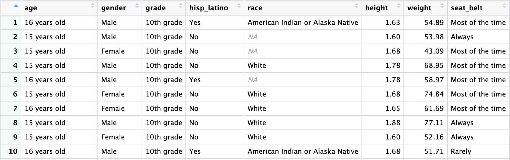
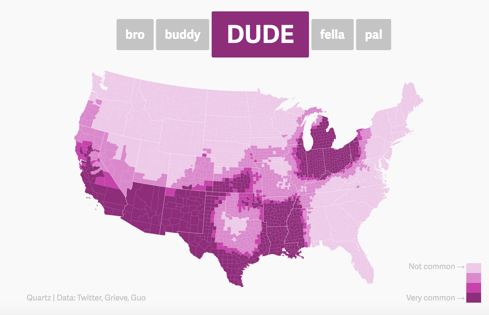

##**<u>Lesson 4: The Data Cycle</u>**

###**Objective:**
Students will learn about the stages of the Data Cycle. 

###**Materials:**
1. The *Data Cycle* file ([LMR_1.3_Data Cycle](../IDS_Curriculum_v_5.0/2_IDS_LMRs_v_6.0/IDS_LMR_Unit 1_v_6.0/LMR_1.3_Data Cycle.pdf))

2. Computer, projector, or board and markers/chalk

3. Printed description of each stage of the Data Cycle (refer to step 3 in the lesson)

4. The *Data Cycle Spinners* handout ([LMR_1.4_Data Cycle Spinners](../IDS_Curriculum_v_5.0/2_IDS_LMRs_v_6.0/IDS_LMR_Unit 1_v_6.0/LMR_1.4_Data Cycle Spinners.pdf))

5. RStudio: [https://portal.idsucla.org](https://portal.idsucla.org "https://portal.idsucla.org")

6. Article headline: *People Who Order Coffee Black Are More Likely To Be Psychopaths*

7. *Dude Map* found at (open in new tab): [https://qz.com/316906/the-dude-map-how-american-men-refer-to-their-bros/](https://qz.com/316906/the-dude-map-how-american-men-refer-to-their-bros/ "https://qz.com/316906/the-dude-map-how-american-men-refer-to-their-bros/")

8. *Bros & Dudes Graphics* handout ([LMR_1.5_Bros & Dudes Graphics](../IDS_Curriculum_v_5.0/2_IDS_LMRs_v_6.0/IDS_LMR_Unit 1_v_6.0/LMR_1.5_Bros & Dudes Graphics.pdf))

9. Sticky notes

10. Poster paper

###**Vocabulary:**
[data cycle](../../vocabulary/unit1/#data-cycle "a guide we can use when leanring to think about data"){ .md-button }
[statistical investigative questions](../../vocabulary/unit1/#statistical-investigative-questions "questions that address variability and can be answered with data"){ .md-button }
[data collection](../../vocabulary/unit1/#data-collection "the process of observing and recording data, or of examining previously collected data to make sure it meets the needs of an investigation"){ .md-button }
[data analysis](../../vocabulary/unit1/#data-analysis "tables, graphs, and summaries of the data that are produced to help us find patterns and relationships"){ .md-button }
[data interpretation](../../vocabulary/unit1/#data-interpretation "the statistical questions are answered by referring to the tables, graphs, and summaries made in the Data Analysis phase"){ .md-button }

###**Essential Concepts:**

!!! note "Essential Concepts:"
    A statistical investigation consists of cycling through the four stages of the Data Cycle. The term statistical questions encompasses the variety of questions asked during the statistical problem-solving process which support statistical thinking and reasoning. Statistical investigative questions are perhaps the most important because they are challenging to learn and are the types of questions that determine whether an analysis is productive or not.  Statistical investigative questions are questions that address variability and are productive in that they motivate data collection, analysis, and interpretation. The Data Collection phase might consist of collecting data through Participatory Sensing or some other means, or it might consist of examining previously collected data to determine the quality of the data for answering the statistical investigative questions. Data Analysis is almost always done on the computer and consists of creating relevant graphics and numerical summaries of the data. Data Interpretation is involved with using the analysis to answer the statistical investigative questions. 

###**Lesson:**
1. During the past few lessons, we have discussed what data are, how to collect and organize them,
and how their values can vary. But what do we do with all this data? How can we navigate it and
turn it into something useful to us?

2. Inform students that they will be learning about the **Data Cycle** today. The Data Cycle is a guide
we can use when learning to think about data. We usually start with posing statistical investigative questions. Display the
graphic from *The Data Cycle* file ([LMR_1.3](../IDS_Curriculum_v_5.0/2_IDS_LMRs_v_6.0/IDS_LMR_Unit 1_v_6.0/LMR_1.3_Data Cycle.pdf)):
    
<iframe src="https://docs.google.com/viewerng/viewer?url=https://curriculum.idsucla.org/IDS_Curriculum_v_5.0/2_IDS_LMRs_v_6.0/IDS_LMR_Unit 1_v_6.0/LMR_1.3_Data Cycle.pdf&embedded=true" style=" width:420px;height:400px;" frameborder="0"></iframe> [LMR_1.3](../IDS_Curriculum_v_5.0/2_IDS_LMRs_v_6.0/IDS_LMR_Unit 1_v_6.0/LMR_1.3_Data Cycle.pdf)

3. Display the Data Cycle on the board or on a projector, and give a brief explanation of the 4
components (listed below).

    **Note:** we will explore each component of the Data Cycle more explicitly throughout the course.

    100. **Pose Statistical Investigative Questions:** Statistical investigative questions are questions that address variability and
    can be answered with data.

    100. **Consider Data:** This is the process of observing and recording data, or of examining
    previously collected data to make sure it meets the needs of the investigation.

    100. **Analyze Data:** During analysis, tables, graphs, and summaries of the data are produced
    to help us find patterns and relationships.

    100. **Interpret Data:** The statistical investigative questions are answered by referring to the tables,
    graphs, and summaries made in the Data Analysis phase.

4. Almost all statistical investigations begin with statistical investigative questions. There are times when the questions may be given to us, so we might start at the data collection step, but this should ideally be our starting point. 

5. As an example, explain that you might ask a person “How old are you?” Although this is a question, it is NOT a statistical investigative question because we are only asking one person so there is no variability in the data. The question “How old are you?”  is a survey question that you might ask if you were trying to answer the investigative question: “How old are the students in my school?” We would need to collect data to answer the question and we would expect student’s ages to vary.

6. To help students get a firm understanding of the Data Cycle and how each component is connected, they will participate in a *Four Corners strategy* (see [Instructional
Strategies](../IDS_Curriculum_v_5.0/4_IDS_Teacher Resources_v_5.0/TR_Instructional Strategies.pdf) in [Teacher Resources](../download/resources.md)). Write down the name of each stage of the Data Cycle on a sheet of paper and include the description of that particular stage (see step 3 for descriptions). Then tape each sheet on a different corner of your room.

7. Explain to the students that you are going to display different artifacts from statistical investigations on the projector. For each artifact, they will move to the corner of the room they feel that artifact represents (posing a statistical investigative question, consider data, analyze data, interpret data). If you have limited space in your classroom or for students that cannot physically participate, you might consider printing [LMR_1.4_Data Cycle Spinners](../IDS_Curriculum_v_5.0/2_IDS_LMRs_v_6.0/IDS_LMR_Unit 1_v_6.0/LMR_1.4_Data Cycle Spinners.pdf). Students can participate by pointing to the spinner.

8. Once students have chosen a corner of the room (stage of the Data Cycle) they will discuss the following with their classmates in that same corner:
    
    100. What part of the data cycle does the artifact represent (posing a statistical investigative question, consider data, analyze data, interpret data)? Why do we think that?

    
    100. What questions or wonderings do we have about the artifact?
    
9. Allow each group time to discuss the questions and have one member from each team (corner) share the answers to the questions. This activity is not about having a correct answer. It is about having students begin to think critically about statistical artifacts that they are constantly consuming. Data are encountered through visualizations, reports from scientific studies, journalists’ articles and websites. This activity is meant to begin to develop students' statistical habits of mind.

10. Artifact 1: Spreadsheet of the CDC data

    

    **Note:** You can display this spreadsheet using RStudio by running the following commands:
`data(cdc)`
`View(cdc)`

    100. What part of the data cycle does the artifact represent (posing a statistical investigative question, consider data, analyze data, interpret data)? Why do we think that?
    ***Answers will vary.***
    
    100. What questions or wonderings do we have about the artifact?
    ***Students should begin developing statistical habits of mind. They should be interrogating the data by asking questions such as:
    Who is the data about? What was the purpose of collecting the data? What was the survey question asked to collect the data?***

11. Artifact 2: Article headline *People Who Order Coffee Black Are More Likely To Be Psychopaths*

    100. What part of the data cycle does the artifact represent (posing a statistical investigative question, consider data, analyze data, interpret data)? Why do we think that?
    ***Answers will vary.***

    100. What questions or wonderings do we have about the artifact? ***Students should be interrogating this headline with questions like: What type of study was this? Who funded the study? What was the purpose of the study? How was the variable measured?***

12. Artifact 3: *Dude Map* found at (open in new tab): [https://qz.com/316906/the-dude-map-how-american-men-refer-to-their-bros/](https://qz.com/316906/the-dude-map-how-american-men-refer-to-their-bros/ "https://qz.com/316906/the-dude-map-how-american-men-refer-to-their-bros/")

    

    100. What part of the data cycle does the artifact represent (posing a statistical investigative question, consider data, analyze data, interpret data)? Why do we think that? ***Answers will vary.***
    100. What questions or wonderings do we have about the artifact? ***Students should be asking questions like: What was the purpose of this study? What variables were measured and how were they measured?***

13. Inform students that the *Dude Map* was created for the *Quartz*
website by Nikhil Sonnad as a data visualization. He collected the data via Twitter. The graphic shows how common the terms: bro, buddy, dude, fella and pal are when referring to friends throughout the United States.

14. Ask students to return to their seats, take out their DS journal and make a sketch of the Data Cycle making sure to include the names of the four stages (Pose statstical investigative question, consider data, analyze data, interpret data).

15. Ask students to write *Dude Map* under the analyze data of their data cycle and the information about where the data came from (see #13) in the consider data part of their Data Cycle sketch.

16. Have each team discuss a possible investigative question that could be answered using the *Dude Map* graphic. Have the reporter/recorder write the question on a sticky note and the resource manager bring it up to the board.

17. Lead a class discussion around the investigative questions the student teams created, and as a class, choose one to write down as an example. ***Example: Where in the United States is the term dude more common to use when referring to a friend?***

18. Allow the teams to work together to answer the investigative question. Ask the reporter/recorder to share their team's interpretation. Have students write down the answer that resonated the most with them under the interpret part of the data cycle.

19. Assign ONE of the pages from the *Bros & Dudes Graphics* handout ([LMR_1.5](../IDS_Curriculum_v_5.0/2_IDS_LMRs_v_6.0/IDS_LMR_Unit 1_v_6.0/LMR_1.5_Bros & Dudes Graphics.pdf)) to each team. There are 10 different
versions of word pairings (10 combinations of 2 words chosen from the 5 options), so multiple
teams will have the same graphic if there are more than 10 teams in a class.
    
<iframe src="https://docs.google.com/viewerng/viewer?url=https://curriculum.idsucla.org/IDS_Curriculum_v_5.0/2_IDS_LMRs_v_6.0/IDS_LMR_Unit 1_v_6.0/LMR_1.5_Bros %26 Dudes Graphics.pdf&embedded=true" style=" width:420px;height:400px;" frameborder="0"></iframe> [LMR_1.5](../IDS_Curriculum_v_5.0/2_IDS_LMRs_v_6.0/IDS_LMR_Unit 1_v_6.0/LMR_1.5_Bros & Dudes Graphics.pdf)

20. The goal of this activity is for each team to complete a full statistical investigation with the *Bros & Dudes Graphics* assigned to them. Tell the teams that they need to create a Data Cycle poster using their assigned graphic for the analyze stage. The cycle should be clearly labeled and have appropriate responses for each of the 4 components.

    ***For example, a team given the “Bro” and “Buddy” graphics might come up with the following questions: Which region of the US is most likely to use the term “Bro” when referring to a friend? Do the coastal areas prefer different terms than the
    Midwest? Is there a difference between northern states versus southern states?***

###**Class Scribes:**
One team of students will give a brief talk to discuss what they think the 3 most important topics
of the day were.

###
**Homework**

Students reformulate any investigative questions generated by their team about the *Bros & Dudes Graphics* that could not be answered so that they can be answered. 