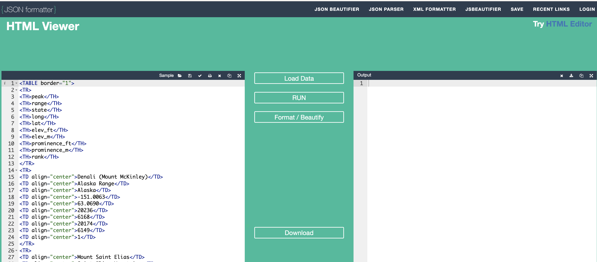
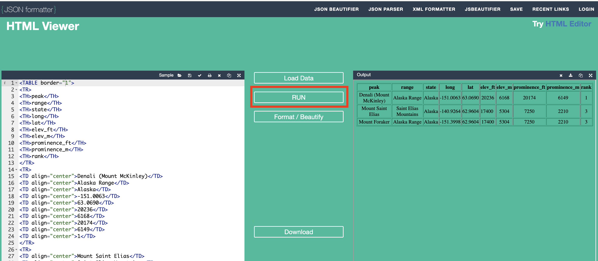
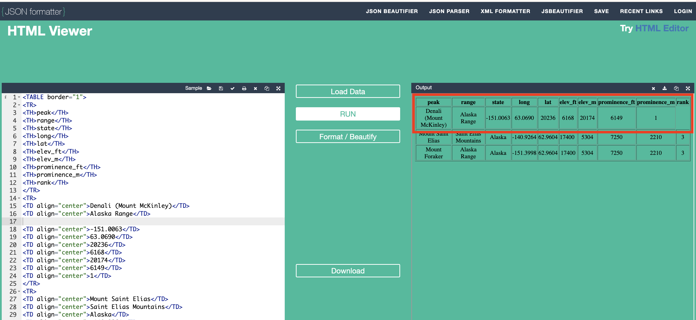

##***<u>Lesson 21: Learning to Love XML</u>***

###**Objective:**
Students will understand the need for data to be stored in different ways - specifically, why it makes
sense for web data to be formatted as XML.

###**Materials:**
1. *Online Data-ing* handout ([LMR_U3_L20_C](../IDS_Curriculum_v_5.0/2_IDS_LMRs_v_6.0/IDS_LMR_Unit 3_v_6.0/LMR_U3_L20_C.pdf))

    **<u>Note:</u>** This should have been completed during the previous class.

2. Mountain Peak XML data found at:<br>
[https://labs.thinkdataed.org/extras/webdata/mountains.html](https://labs.thinkdataed.org/extras/webdata/mountains.html "https://labs.thinkdataed.org/extras/webdata/mountains.html"){:target="_blank"}

    **<u>Note:</u>** Open with Google Chrome or Firefox browsers, NOT with Safari.

3. *Mountains – HTML vs. XML* handout ([LMR_U3_L21](../IDS_Curriculum_v_5.0/2_IDS_LMRs_v_6.0/IDS_LMR_Unit 3_v_6.0/LMR_U3_L21.pdf))

4. XML Viewer found at: <br> [https://jsonformatter.org/xml-viewer](https://jsonformatter.org/xml-viewer "https://jsonformatter.org/xml-viewer"){:target="_blank"}

5. HTML Viewer found at: <br> [https://jsonformatter.org/html-viewer](https://jsonformatter.org/html-viewer "https://jsonformatter.org/html-viewer"){:target="_blank"}

6. Projector

###**Vocabulary:**
[XML](../../vocabulary/unit3/#xml-extensible-markup-language "a popular format for storing data on the internet; it creates readable web pages, and also because it allows programmers to easily update values in the data table if those values change"){ .md-button }

###**Essential Concepts:**

!!! note "Essential Concepts: "
    XML is a programming language that we use with our campaigns. We create basic
    XML "tags" in the code, which help us store data in a format we understand.

###**Lesson:**
1. Allow time for student teams to present their findings from the *Online Data-ing* handout
([LMR_U3_L20_C](../IDS_Curriculum_v_5.0/2_IDS_LMRs_v_6.0/IDS_LMR_Unit 3_v_6.0/LMR_U3_L20_C.pdf)) if there was not sufficient time during the previous lesson.

2. Remind students that in the previous lesson they learned about a variety of ways that data can be
presented online.

3. They've been working with comma separated (CSV) files and R data frames. Last time and in the
lab, they worked with HTML tables. Today they are going to learn how the data in tables built with HTML can be stored using XML.

4. **XML**, or Extensible Mark up Language, is a popular format for storing data on the Internet. It allows programmers to easily update values in a data table if those values change.

5. In pairs, ask students to brainstorm ways in which data that is found online is different than the
way we see data in RStudio. Then, create a class brainstorm from the student pair responses.

6. After the brainstorm, emphasize the following:

    100. RStudio’s default way to work with data is as large data frames (tables) where rows
    represent observations and columns represent variables.
    
    100. Data that is viewed online often has a different structure.
    
    100. Data structures found on the web might be displayed in tables, such as those on
    Wikipedia, or streams, such as Twitter, and might even include data spread across
    multiple sections of a web page, such as Yelp.
    
    Show students, on a projector, the Mountain Peak XML data found at<br>
    [https://labs.thinkdataed.org/extras/webdata/mountains.html](https://labs.thinkdataed.org/extras/webdata/mountains.html "https://labs.thinkdataed.org/extras/webdata/mountains.html"){:target="_blank"}
    
    Ask students to look at the data and determine if they have seen it before. Hint: They have! It was
    the data they scraped during [Lab 3E](lab3e.md).

7. Once students figure out that the XML is just the same data as the website they scraped during
[Lab 3E](lab3e.md), distribute the *Mountains – HTML vs. XML* handout ([LMR_U3_L21](../IDS_Curriculum_v_5.0/2_IDS_LMRs_v_6.0/IDS_LMR_Unit 3_v_6.0/LMR_U3_L21.pdf)), which displays both
HTML and XML versions of the data.

    **<u>Note:</u>** Provide an electronic copy of [LMR_U3_L21](../IDS_Curriculum_v_5.0/2_IDS_LMRs_v_6.0/IDS_LMR_Unit 3_v_6.0/LMR_U3_L21.pdf) for students to easily copy/paste the code later in the lesson. The handout only includes the first 3 mountains.

    <div align="right"><iframe src="https://docs.google.com/viewerng/viewer?url=https://curriculum.thinkdataed.org/IDS_Curriculum_v_5.0/2_IDS_LMRs_v_6.0/IDS_LMR_Unit 3_v_6.0/LMR_U3_L21.pdf&embedded=true" style=" width:420px;height:400px;" frameborder="0"></iframe><br>[LMR_U3_L21](../IDS_Curriculum_v_5.0/2_IDS_LMRs_v_6.0/IDS_LMR_Unit 3_v_6.0/LMR_U3_L21.pdf)</div>

8. Ask student pairs to answer the following:

    100. Why are certain XML tags indented in the XML version of the data? <span style="color:grey">***Answer: The indentations
    help us visually see the structure of the data. For example, all the mountains are
    contained in the &lt;data> section, but are further tagged by each particular mountain
    within the &lt;mountain> and &lt;/mountain> tags. All information stored between those
    two tags will be displayed as one row of the HTML table.***</span>

    100. What are the role of tags (ex. &lt;state>) and end tags (ex. &lt;/state>) in the XML code?
    <span style="color:grey">***Answer: Tags tell us when a certain type of data begins, and end tags tell us when the data
    should end. In other words, it tells us where to find the specific values of a variable
    (ex. Alaska would be the value of the “state” variable since it is between the
    &lt;state> and &lt;/state> tags).***</span>

    100. Where are the variable names? <span style="color:grey">***Answer: The variable names can be found between each
    &lt;mountain> and &lt;/mountain> tags. Specifically, the first variable is “peak” and the
    last variable is “rank.”***</span>
    
    100. Where are the observations? <span style="color:grey">***Answer: The observations are located within each of the
    variable tags. For example, the observation “Denali (Mount McKinley)” is found
    between the &lt;peak> and &lt;/peak> tags.  ***</span>  

9. Assign student pairs one of the above questions to share out with the class. Student pairs that did
not receive an assignment must participate using the *Agree/Disagree* strategy.

10. As a class, discuss the answers to the questions above.

11. Inform students that they will be comparing how HTML and XML code display by default.

12. Demonstrate how to navigate to the two websites we will be using to display the HTML and XML code by projecting the following URLs:

    a. [https://jsonformatter.org/xml-viewer](https://jsonformatter.org/xml-viewer "https://jsonformatter.org/xml-viewer"){:target="_blank"}

    b. [https://jsonformatter.org/html-viewer](https://jsonformatter.org/html-viewer "https://jsonformatter.org/html-viewer"){:target="_blank"}

13. Inform students that they will be copying and pasting their XML code from the electronic copy of LMR_U3_L21 into the left "XML Viewer" (Input XML) panel as shown below.

    

14. In order to view how the XML code displays, click "XML Viewer" in the center of the web page as shown below.

    **<u>Note:</u>** Click on the dropdown arrows of the Output XML to explore how it is displayed

    

15. We want to compare how the XML code displays with how the HTML code displays. Inform students that they will now be copying and pasting their HTML code into the left "HTML Viewer" (Input HTML) panel as shown below.

    

16. In order to view how the HTML code displays, click "RUN" in the center of the web page as shown below.

    

17. Examine the differences in how HTML and XML are displayed. Ask:

    a. What do you notice? <span style="color:grey">***Answers will vary but students might notice that HTML is displayed as a table while XML displays the data in a list-like format. XML also has each data value tied to the variable name while HTML has one variable name for the three data values it represents.***</span>

    b. How does the Output XML compare to the Output HTML? <span style="color:grey">***Possible answers might be that XML shows the data organized but not in any type of visualization/table while HTML is displayed as a table.***</span>

18. One of the benefits of XML is that removing a data point effectively removes it from the data file but does not necessarily change the integrity of the data - the variable names are still tied to the data values. Demonstrate this by removing a data point from the Input XML and then click "XML Viewer" again to see the updated Output XML.

    **<u>Note:</u>** In the image below, the ```<state>Alaska</state>``` data point has been removed.
    
    
    
19. Examine the updated Output XML. Ask:

    a. What changed when we removed a data point? <span style="color:grey">***Answer: The first section of mountain data now has 9 data values instead of 10.***</span>

    b. Can we still analyze this data accurately? <span style="color:grey">***Answer: Yes, each data value is still tied to the variable name that represents it.***</span>

    c. What do you think will happen when we remove a data point from our HTML code? <span style="color:grey">***Answers will vary.***</span>

20. Demonstrate removing a data point from the Input HTML and then click "RUN" again to see the updated Output HTML.

    **<u>Note</u>** In the image below, the ```<TD align="center">Alaska</TD>``` data point has been removed.
    
    

21. Examine the updated Output HTML. Ask:

    a. What changed when we removed a data point? <span style="color:grey">***Answer: The table has a blank value at "rank" and it appears that all the data values in that row have shifted over – HTML skipped the missing data value and filled in the rest of the table with the data values given.***</span>

    b. Can we still analyze this data accurately? <span style="color:grey">***Answer: No, starting with the "state" value that is missing, all of the values in the row shifted to the left ending up in the wrong columns.***</span>

22. Summarieze: XML formats make it easier to store data on the web in a pleasing manner and make it easier for
programmers to find and alter data if the values change or if, for example, they wish to add a new
row to a table. Depending on how the web page presents the XML (table, list, etc.), the consequences of changing the data vary on how the program is designed to display it.

###**Class Scribes:**
One team of students will give a brief talk to discuss what they think the 3 most important topics of the
day were.

###<p style="background: black; color: white; text-align: center;">**Homework**</p>
For the next 3 days, students will collect data using the class’s newly created Participatory Sensing
campaign (see [Lessons 17](lesson17.md)-[19](lesson19.md)).

For homework, students should reflect on the purpose of XML and HTML as it pertains to data.