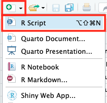
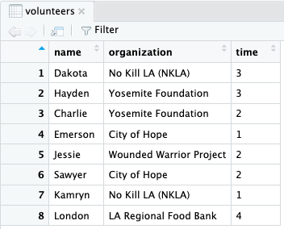

##***<u>Lesson 22: Changing Format</u>***

###**Objective:**
Students will learn how to convert XML files to the more familiar data table format and vice versa.

###**Materials:**
1. RStudio

2. *There and Back Again: From XML to Data Tables* handout ([LMR_U3_L22_A](../IDS_Curriculum_v_5.0/2_IDS_LMRs_v_6.0/IDS_LMR_Unit 3_v_6.0/LMR_U3_L22_A.pdf))

    **<u>Note:</u>** An electronic copy should be provided to students (see step 3 in lesson)

2. *There and Back Again: From Data Tables to XML* handout ([LMR_U3_L22_B](../IDS_Curriculum_v_5.0/2_IDS_LMRs_v_6.0/IDS_LMR_Unit 3_v_6.0/LMR_U3_L22_B.pdf))

###**Essential Concepts:**

!!! note "Essential Concepts: "
    Converting XML to spreadsheet format helps us better understand and view our
    data.

###**Lesson:**
1. Take a few minutes to compare the default views of XML code to HTML code (refer to steps 14 and 16
from [Lesson 21](lesson21.md)).

2. Inform students that in today’s lesson, they will learn how to translate information from XML code
into a data table.

3. Distribute the *There and Back Again: From XML to Data Tables* handout ([LMR_U3_L22_A](../IDS_Curriculum_v_5.0/2_IDS_LMRs_v_6.0/IDS_LMR_Unit 3_v_6.0/LMR_U3_L22_A.pdf)) to students.

    **<u>Note:</u>** Provide an electronic copy of [LMR_U3_L22_A](../IDS_Curriculum_v_5.0/2_IDS_LMRs_v_6.0/IDS_LMR_Unit 3_v_6.0/LMR_U3_L22_A.pdf) for students to easily copy/paste the code later in the lesson.

    <div align="right"><iframe src="https://docs.google.com/viewerng/viewer?url=https://curriculum.thinkdataed.org/IDS_Curriculum_v_5.0/2_IDS_LMRs_v_6.0/IDS_LMR_Unit 3_v_6.0/LMR_U3_L22_A.pdf&embedded=true" style=" width:420px;height:400px;" frameborder="0"></iframe><br>[LMR_U3_L22_A](../IDS_Curriculum_v_5.0/2_IDS_LMRs_v_6.0/IDS_LMR_Unit 3_v_6.0/LMR_U3_L22_A.pdf)</div>

4. Inform the students that XML code is provided on page 1 of the handout. Their goal is to
translate the XML code in RStudio into a readable table. They will then transfer all of the information to the empty data table in the handout.

    **<u>Note:</u>** It may be helpful to create a new RScript for the process.

    

5. Load the XML package by running the following code:

        library("XML")

6. Next, assign the data the name **```volunteers```** and copy/paste the code within quotes. Verify that it is in your Environment.

    

7. Ask students: "How does our data look? Can we analyze it?" <span style="color:grey">***Answers will vary but students should notice that RStudio/Posit Cloud is displaying it in XML format (```\n``` means new line).***</span>

    

8. We need to translate our XML data into something that RStudio recognizes. The **```xmlParse()```** function will do this for us. Run the following line of code to translate our data into something RStudio/Posit Cloud will recognize.

        volunteers <- xmlParse(volunteers)

9. Ask students: "How is RStudio recognizing our **```volunteers```** data now?" <span style="color:grey">***Answers will vary but students should see that RStudio/Posit Cloud recognizes our data as an XML file. Their Environment pane should show the data as an 'XMLInternalDocument'.***</span>

    

10. We're getting closer - RStudio now recognizes our data as an XML file. Let's do one final translation by using the **```xmlToDataFrame()```** function to translate our xml file into an R data frame. Run the code below:

        volunteers <- xmlToDataFrame(volunteers)

11. Ask students: "What happened when we translated our xml file into an R data frame?" <span style="color:grey">***Answers will vary but the data should look familiar now - it displays in the Environment pane like datasets we have worked with throughout the year (```cdc```, ```atus```, ```slasher```, and ```titanic```).***</span>

    

12. Have students **```View```** the **```volunteers```** data and fill in their table in [LMR_U3_L22_A](../IDS_Curriculum_v_5.0/2_IDS_LMRs_v_6.0/IDS_LMR_Unit 3_v_6.0/LMR_U3_L22_A.pdf).

    

13. Provide time for students to complete the handout individually.

14. Then, conduct a whole class discussion regarding student responses to the questions on page 2
of the handout.

15. Distribute the *There and Back Again: From Data Tables to XML* ([LMR_U3_L22_B](../IDS_Curriculum_v_5.0/2_IDS_LMRs_v_6.0/IDS_LMR_Unit 3_v_6.0/LMR_U3_L22_B.pdf)) to student teams
and allow them time to complete it.
    <div align="right"><iframe src="https://docs.google.com/viewerng/viewer?url=https://curriculum.thinkdataed.org/IDS_Curriculum_v_5.0/2_IDS_LMRs_v_6.0/IDS_LMR_Unit 3_v_6.0/LMR_U3_L22_B.pdf&embedded=true" style=" width:420px;height:400px;" frameborder="0"></iframe><br>[LMR_U3_L22_B](../IDS_Curriculum_v_5.0/2_IDS_LMRs_v_6.0/IDS_LMR_Unit 3_v_6.0/LMR_U3_L22_B.pdf)</div>

16. Once teams have finished, teams will guide you to write the correct XML code.

17. Using a *Whip Around*, teams will tell you the first line of the XML code you need to write. Teams
waiting their turn will check if the team is guiding you correctly. If not, they need to stop you and
propose their line of code. Do not continue writing the lines of code until all teams agree.

###**Class Scribes:**
One team of students will give a brief talk to discuss what they think the 3 most important topics of the
day were.

###<p style="background: black; color: white; text-align: center;">**Homework & Next Day**</p>
Students will continue to collect data using the class’s Participatory Sensing campaign (see [Lessons 17](lesson17.md)-
[19](lesson19.md)). They will analyze the data the next day during the *What Does Our Campaign Data Say?* Practicum.