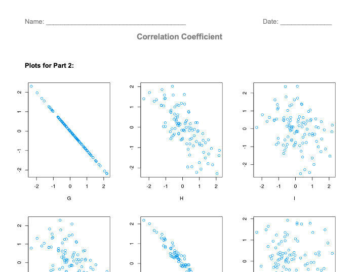

##***<u>Lesson 12: How Strong Is It?</u>***

###**Objective:**
Students will learn that the correlation coefficient is a value that measures the strength in linear
associations only.

###**Materials:**
1. *Strength of Association* handout ([LMR_U4_L12_A](../IDS_Curriculum_v_5.0/2_IDS_LMRs_v_6.0/IDS_LMR_Unit 4_v_6.0/LMR_U4_L12_A.pdf))

2. *Correlation Coefficient* handout ([LMR_U4_L12_B](../IDS_Curriculum_v_5.0/2_IDS_LMRs_v_6.0/IDS_LMR_Unit 4_v_6.0/LMR_U4_L12_B.pdf))

    **<u>Advance preparation required:</u>** This handout is the resource for the plot cutouts. DO NOT
    distribute as-is to students (see steps 6 and 10 in the lesson)

###**Vocabulary:**
[correlation coefficient](../../vocabulary/unit4/#correlation-coefficient "a statistical measure that calculates the strength of the relationship between the relative movements of two variables"){ .md-button }
[strength of association](../../vocabulary/unit4/#strength-of-association "how much two variables covary and the extent to which the INDEPENDENT VARIABLE affects the DEPENDENT VARIABLE"){ .md-button }

###**Essential Concepts:**

!!! note "Essential Concepts: "
    A high absolute value for correlation means a strong linear trend. A value close to 0
    means a weak linear trend.

###**Lesson:**
1. Distribute the *Strength of Association* handout ([LMR_U4_L12_A](../IDS_Curriculum_v_5.0/2_IDS_LMRs_v_6.0/IDS_LMR_Unit 4_v_6.0/LMR_U4_L12_A.pdf)). In teams, students will
examine the scatterplots (b) through (e). Their task is to discuss the **strength of the association**
for each plot. They will determine which plots they think show strong associations and which ones
they believe show weak associations. They must explain how they made their decision. Reasons
must reference the plots.

    
<iframe src="https://docs.google.com/viewerng/viewer?url=https://ids-curriculum.idsucla.org/IDS_Curriculum_v_5.0/2_IDS_LMRs_v_6.0/IDS_LMR_Unit 4_v_6.0/LMR_U4_L12_A.pdf&embedded=true" style=" width:420px;height:400px;" frameborder="0"></iframe> [LMR_U4_L12_A](../IDS_Curriculum_v_5.0/2_IDS_LMRs_v_6.0/IDS_LMR_Unit 4_v_6.0/LMR_U4_L12_A.pdf)

2. As an example, demonstrate how to describe plot (a) in the [*Strength of Association*](../IDS_Curriculum_v_5.0/2_IDS_LMRs_v_6.0/IDS_LMR_Unit 4_v_6.0/LMR_U4_L12_A.pdf) handout.
***Possible description: Plot (a) shows a negative association, or decreasing trend. The
association appears to be fairly strong because the points are relatively close together,
forming a moderate linear pattern.***

3. Once all teams have completed the handout, assign one plot to each team for a share out. If two teams have the same plot, one team will share its explanation first and the second team can agree, disagree, or add to the first team’s description

4. Guide students to understand that a strong association has points closer to each other and a weak association has points more scattered.

5. Inform students that, so far, they have been labeling associations as strong, very strong, or weak.
A number called the **correlation coefficient** measures strength of association. The correlation
coefficient only applies to linear relationships, which must be checked visually with a scatterplot.
Later we will learn how to calculate this number using RStudio.

6. Distribute the envelopes, with plots from [LMR_U4_L12_B](../IDS_Curriculum_v_5.0/2_IDS_LMRs_v_6.0/IDS_LMR_Unit 4_v_6.0/LMR_U4_L12_B.pdf) (Part 1), to the teams. Students will examine the strength of association in each
plot. Their task is to assign the correlation coefficient that corresponds to each plot and to explain
why they assigned that correlation coefficient to that particular plot. The only piece of information
they will receive is that a correlation coefficient equal to 1 has the strongest linear association and
a correlation coefficient equal to 0 has the weakest association.

    **<u>Advance preparation required:</u>**Each team needs one envelope
    with cutouts of plots A-F in [LMR_U4_L12_B](../IDS_Curriculum_v_5.0/2_IDS_LMRs_v_6.0/IDS_LMR_Unit 4_v_6.0/LMR_U4_L12_B.pdf) (Part 1). Make envelopes according to the number of
    teams in the class.

    

7. Assign each team one plot. If there are more teams than plots, these teams will be assigned a
plot in the next round. Each team will share the correlation coefficient they assigned to their plot
and the explanation that goes with it.

8. Using the *Voting Cards* strategy (see Instructional Strategies), the rest of the teams will show
whether they A - approve, B - disapprove, or C - are uncertain, about the teams’ assignment and/or
explanation. Repeat for each plot. The correlation coefficients for each plot are:

    • ***Plot A: r = 1.00***

    • ***Plot B: r = 0.72***

    • ***Plot C: r = 0.19***

    • ***Plot D: r = 0.48***

    • ***Plot E: r = 0.98***

    • ***Plot F: r = 0.00***

9. The last set of plots showed positive associations. Now students will assign the correlation
coefficients for plots G-L for [LMR_U4_L12_B](../IDS_Curriculum_v_5.0/2_IDS_LMRs_v_6.0/IDS_LMR_Unit 4_v_6.0/LMR_U4_L12_B.pdf) (Part 2).

10. Distribute the envelopes, with the plots from [LMR_U4_L12_B](../IDS_Curriculum_v_5.0/2_IDS_LMRs_v_6.0/IDS_LMR_Unit 4_v_6.0/LMR_U4_L12_B.pdf) (Part 2), to the teams. Students will examine the strength of association in each
plot. Their task is to assign the correlation coefficient that corresponds to each plot and to explain
why they assigned that correlation coefficient to that particular plot. The only piece of information
they will receive is that a correlation coefficient equal to -1 has the strongest linear association
and a correlation coefficient equal to 0 has the weakest association.

    **<u>Advance preparation required:</u>**Each team needs one envelope
    with cutouts of plots G-L in [LMR_U4_L12_B](../IDS_Curriculum_v_5.0/2_IDS_LMRs_v_6.0/IDS_LMR_Unit 4_v_6.0/LMR_U4_L12_B.pdf) (Part 2). Make envelopes according to the number of
    teams in the class.

    

11. Teams previously not assigned a plot are now assigned one. Each team will share the correlation
coefficient they assigned to their plot and the explanation that goes with it.

12. Using the *Voting Cards* strategy, the rest of the teams will show whether they approve,
disapprove, or are uncertain about the teams’ assignment and/or explanation. Lead a class
discussion whenever there is disapproval or uncertainty. Repeat for each plot. The correlation
coefficients for each plot are:

    • ***Plot G: r = -1.00***

    • ***Plot H: r = -0.72***

    • ***Plot I: r = -0.19***

    • ***Plot J: r = -0.48***

    • ***Plot K: r = -0.98***

    • ***Plot L: r = 0.00***

13. Journal Entry: What is a correlation coefficient, what does it do, and what does it tell us about a
scatterplot?

###
**Homework & Next Day**

Students will complete the journal entry for homework if not completed in class.

[<u>***LAB 4D: Interpreting Correlations***</u>](lab4d.md)

Complete [Lab 4D](lab4d.md) prior to [Lesson 13](lesson13.md).
