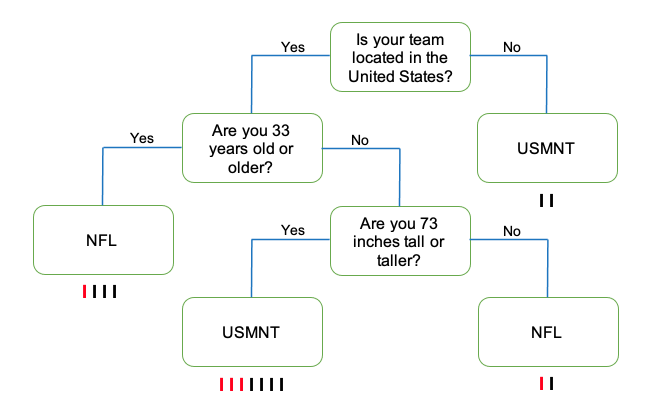
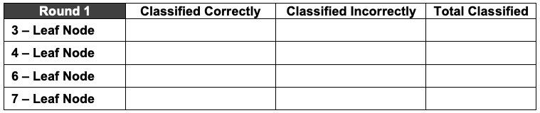
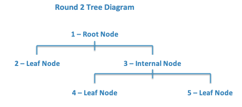
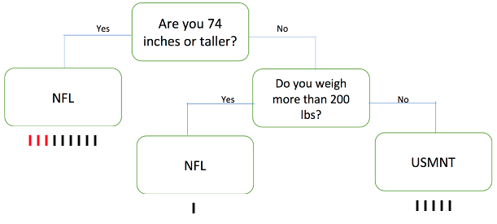

##***<u>Lesson 16: Football or Futbol?</u>***

###**Objective:**
Students will learn what decision trees look like and how they can be used to classify people or objects into groups. They will engage in an activity to see how making slight changes to the tree can lead to drastic rises or reductions in misclassifications.

###**Materials:**
1. *Decision Tree for Heart Attack Risk* graphic ([LMR_4.19_CART Heart Attacks](../IDS_Curriculum_v_5.0/2_IDS_LMRs_v_6.0/IDS_LMR_Unit 4_v_6.0/LMR_4.19_CART Heart Attacks.pdf))

2. *CART Activity Player Stats* ([LMR_4.20_CART Player Stats](../IDS_Curriculum_v_5.0/2_IDS_LMRs_v_6.0/IDS_LMR_Unit 4_v_6.0/LMR_4.20_CART Player Stats.pdf))

3. *CART Activity Round 1 Questions* ([LMR_4.21_CART Round 1](../IDS_Curriculum_v_5.0/2_IDS_LMRs_v_6.0/IDS_LMR_Unit 4_v_6.0/LMR_4.21_CART Round 1.pdf))

4. *CART Activity Round 2 Questions* ([LMR_4.22_CART Round 2](../IDS_Curriculum_v_5.0/2_IDS_LMRs_v_6.0/IDS_LMR_Unit 4_v_6.0/LMR_4.22_CART Round 2.pdf))

    **<u>Note:</u>** Advanced preparation required for LMR_4.20, 4.21, and 4.22 (see Step 8 below)

###**Vocabulary:**
[classify](../../vocabulary/unit4/#classify "is the problem of identifying which of a set of categories (sub-populations) an observation (or observations), belongs to"){ .md-button }
[decision tree](../../vocabulary/unit4/#decision-tree "a decision support tool that uses a tree-like model of decisions and their possible consequences, including chance outcomes"){ .md-button }
[Classification and Regression Trees (CART)](../../vocabulary/unit4/#classification-and-regression-trees-cart "a predictive algorithm used in machine leanring; it explains how a target variable's values can be predicted based on other values"){ .md-button }
[nodes](../../vocabulary/unit4/#nodes "a point of intersection/connection within a data communication network"){ .md-button }

###**Essential Concepts:**

!!! note "Essential Concepts: " 
    Some trends are not linear, so the approaches we’ve done so far won’t be helpful. We need to model such trends differently. Decision trees are a non-linear tool for classifying observations into groups when the trend is non-linear.

###**Lesson:**
1. Ask students the following question:   ***If you were having chest pains, who would you trust more to diagnose you - a data scientist or a doctor?***

2. Give the students some time to think about the question and have a few of them share out their responses with the class.   **<u>Note:</u>** It's likely that most students will choose to go to a doctor.

3. As it turns out, back in the late 1970s, a cardiologist (and early data scientist) named Lee Goldman developed a decision tree based on millions of patient observations. It was made to diagnose whether people were or were not having a heart attack. The accuracy of the decision tree compared to the accuracy of actual doctor diagnoses are shown below.

    100. Correct diagnoses using the decision tree were above 95%.

    100. Correct diagnoses based on individual doctors' expertise was anywhere between 75-90%.

4. Display the graphic from the *Decision Tree for Heart Attack Risk* handout ([LMR_4.19_CART Heart Attacks](../IDS_Curriculum_v_5.0/2_IDS_LMRs_v_6.0/IDS_LMR_Unit 4_v_6.0/LMR_4.19_CART Heart Attacks.pdf)) and explain that this is one example of what the decision tree that Goldman developed might have looked like.   **<u>Note:</u>** This is NOT the actual tree that Goldman developed.

     
<iframe src="https://docs.google.com/viewerng/viewer?url=https://curriculum.idsucla.org/IDS_Curriculum_v_5.0/2_IDS_LMRs_v_6.0/IDS_LMR_Unit 4_v_6.0/LMR_4.19_CART Heart Attacks.pdf&embedded=true" style=" width:420px;height:400px;" frameborder="0"></iframe> [LMR_4.19](../IDS_Curriculum_v_5.0/2_IDS_LMRs_v_6.0/IDS_LMR_Unit 4_v_6.0/LMR_4.19_CART Heart Attacks.pdf)

5. Using a *Pair-Share*, ask students to discuss the following questions using the graphic above.   **<u>Note:</u>** Answers will vary. These questions are meant to gauge student thinking before defining decision trees in the following steps of the lesson.

    100. What are decision trees?

    100. How do they work at classifying data into groups?

6. Remind students that this unit has focused on linear models and making predictions. In the real world, data can be modeled in a variety of ways, many of which are non-linear, and because of this, we can’t easily write down a mathematical equation to help us make predictions. However, we can use what we have learned so far to determine whether or not other models can provide a good fit to the data.

7. Let students know that one meethod of modeling data in a non-linear way is with **decision trees**, like the one we saw with the heart attack classification. Explain that decision trees are "grown" by using algorithms, or rules, to test many, many different decision trees to find the one that makes the best predictions.

8. A decision tree is basically a series of questions that are asked sequentially. Observations start by answering the first question (at the root of the tree), and then proceed along the different branches based on the answers they give to the questions that follow. At the end, based on all of the questions asked, observations are then classified as one of *k* classifications.

9. Remind students that algorithms are a series of steps that are repeated a large number of times. For decision trees, this enables us to (1) explore many possible paths, beginning from the same initial point, or (2) find different starting points based on where we ended during the previous iteration.

10. Inform students that, during today's lesson, they will be participating in an activity to try to **classify** professional athletes into one of two groups: (1) soccer players on the US Men's National Team, OR (2) football players in the National Football League (NFL).

11. Ask students to recall that they created and worked with *linear models* earlier in the unit. We are continuing our work with models and will learn another method of modeling called **CART**, which stands for **Classification and Regression Trees**. This is an umbrella term to refer to the following types of decision trees.

    100. <u>Classification Trees:</u> the leaves predict the values of a categorical variable

    100. <u>Regression Trees:</u> the leaves predict a numerical value

12. CART Activity: to get a sense of how decision trees work, the students will see one in action. We are going to try to classify 15 professional athletes into either soccer or football players based on some of their characteristics.

    **<u>Note:</u>** Advanced preparation required. The cards in LMR4.20, 4.21, and 4.22 listed above (and previewed below) need to be cut out prior to class time.

    
<iframe src="https://docs.google.com/viewerng/viewer?url=https://curriculum.idsucla.org/IDS_Curriculum_v_5.0/2_IDS_LMRs_v_6.0/IDS_LMR_Unit 4_v_6.0/LMR_4.20_CART Player Stats.pdf&embedded=true" style=" width:420px;height:400px;" frameborder="0"></iframe> [LMR_4.20](../IDS_Curriculum_v_5.0/2_IDS_LMRs_v_6.0/IDS_LMR_Unit 4_v_6.0/LMR_4.20_CART Player Stats.pdf)

    
<iframe src="https://docs.google.com/viewerng/viewer?url=https://curriculum.idsucla.org/IDS_Curriculum_v_5.0/2_IDS_LMRs_v_6.0/IDS_LMR_Unit 4_v_6.0/LMR_4.21_CART Round 1.pdf&embedded=true" style=" width:420px;height:400px;" frameborder="0"></iframe> [LMR_4.21](../IDS_Curriculum_v_5.0/2_IDS_LMRs_v_6.0/IDS_LMR_Unit 4_v_6.0/LMR_4.21_CART Round 1.pdf)

    
<iframe src="https://docs.google.com/viewerng/viewer?url=https://curriculum.idsucla.org/IDS_Curriculum_v_5.0/2_IDS_LMRs_v_6.0/IDS_LMR_Unit 4_v_6.0/LMR_4.22_CART Round 2.pdf&embedded=true" style=" width:420px;height:400px;" frameborder="0"></iframe> [LMR_4.22](../IDS_Curriculum_v_5.0/2_IDS_LMRs_v_6.0/IDS_LMR_Unit 4_v_6.0/LMR_4.22_CART Round 2.pdf)

13. Ask for 15 volunteers and hand each of them a data card from the *CART Activity Player Stats* handout ([LMR_4.20](../IDS_Curriculum_v_5.0/2_IDS_LMRs_v_6.0/IDS_LMR_Unit 4_v_6.0/LMR_4.20_CART Player Stats.pdf)). These students will be known as the “players”. Each card lists the following variables for 15 different professional athletes:

    a. team location

    b. name

    c. age

    d. height (in inches)

    e. weight (in pounds)

    f. league

14. The “players” will only be allowed to say “yes” or “no” in this activity. No other talking is permitted.

15. Now, ask for 7 additional volunteers to be the ***nodes*** on the classification tree. There are three types of nodes in a decision tree:

    100. Root node - the initial question/characteristic that splits the population/dataset

    100. Internal nodes - a question/characteristic that splits the data

    100. Leaf nodes - an "end" where no more splitting is possible

16. Distribute one question/classification from the *CART Activity Round 1 Questions* ([LMR_4.21](../IDS_Curriculum_v_5.0/2_IDS_LMRs_v_6.0/IDS_LMR_Unit 4_v_6.0/LMR_4.21_CART Round 1.pdf)) to each node.

17. Arrange the 7 nodes in the room as depicted by the graphic below:

18. Now, each “player”, one at a time, will approach *1 - Root Node*, who will ask the “player” the question listed on his/her card. Depending on the player’s answer, *1 - Root Node* will direct the “player” to the next node.

19. The “player” continues through the nodes until a leaf declares the “player” to be either (1) a soccer player on the US Men’s National Team, OR (2) a football player in the National Football League (NFL).

20. Allow all the “players” to go through the nodes until each one is classified as either a soccer or football player.

21. After each player has been classified, record the classifications in the table below. The tally marks below correspond with classified incorrectly (red) and classified correctly (black), if all the player stats cards are used.

**<u>Note:</u>** This table will be referenced again later. A filled-out version is available in the next lesson.

22. Ask students, "How successful were we in classifying players correctly?" ***Answers will vary but if all the activity player stats cards were used then 10/15, or 67%, were classfied correctly. Students might measure success by saying that we only misclassified players 5/15, or 33%, of the time - this is called the misclassification rate (MCR) and will be defined in the next lesson.***

23. After proceeding through “Round 1,” ask an additional 5 students to come up as more nodes, distribute the cards from the CART Activity Round 2 Questions strips ([LMR_4.22](../IDS_Curriculum_v_5.0/2_IDS_LMRs_v_6.0/IDS_LMR_Unit 4_v_6.0/LMR_4.22_CART Round 2.pdf)), and arrange the students like the diagram below:

24. Have each “player” go through this new set of nodes until they are re-classified by these new rules.

25. After each player has been classified, record the classifications in the table below. The tally marks below correspond with classified incorrectly (red) and classified correctly (black), if all the player stats cards are used.

**<u>Note:</u>** This table will be referenced again later. A filled-out version is available in the next lesson.

26. Ask students, "How successful were we in classifying players correctly in this second round?" ***Answers will vary but if all the activity player stats cards were used then 12/15, or 80%, were classfied correctly. Students might measure success by saying that we only misclassified players 3/15, or 20%, of the time - this is called the misclassification rate (MCR) and will be defined in the next lesson.***

27. Once the activity has been completed, ask students the following questions:

    100. How do decision trees classify objects/people as being a member of a group? ***Answer: By asking a series of questions, one at a time, and sending the participant down a particular path until he/she is classified.***

    100. Did we do as well, worse, or better in Round 2 compared to Round 1 at correctly
    guessing which sport the “players” participate in? Explain. ***Answers will vary according to results of the activity. If all player stats cards were used then we did better in Round 2, with 80% success, than Round 1, with 67% success, in correctly guessing which sport the "players" participate in.***

    100. How can we figure out what questions to ask and in what order to minimize the number of incorrect classifications (also known as *misclassifications*)? ***Answers will vary. This one might not be obvious but the point is for the students to wrestle with how they might think it can be done.***

###**Class Scribes:**
One team of students will give a brief talk to discuss what they think the 3 most important topics of the day were.

###
**Homework**

Students will find a decision tree online that aligns with their interests and:

a. identify the nodes - root, internal, and leaf

b. describe the population that it applies to

c. describe what the decision tree is predicting, i.e., waht are the classifications at the leaves?