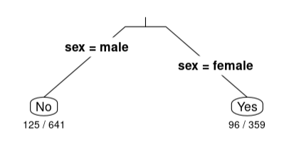

##***<u>Lesson 17: Grow Your Own Decision Tree</u>***

###**Objective:**
Students will create their own decision trees based on training data (i.e., the data from the previous day's
lessons), and then see how well their decision tree works on new test data.

###**Materials:**
1. *Make Your Own Decision Tree* handout ([LMR_U4_L17](../IDS_Curriculum_v_5.0/2_IDS_LMRs_v_6.0/IDS_LMR_Unit4_v_7/LMR_U4_L17.pdf))

    **<u>Optional:</u>** Provide code to students to create the training data in RStudio (see step 8 in lesson)

###**Vocabulary:**
[misclassification rate (MCR)](../../vocabulary/unit4/#misclassification-rate "the proportion of observations who were predicted to be in one category but were actually in another"){ .md-button }
[training data](../../vocabulary/unit4/#training-data "a random subset consisting of about 75-85% of the original dataset on which a model is trained"){ .md-button }
[test data](../../vocabulary/unit4/#testing-data "a random subset consisting of about 15-25% of the original dataset on which a model is tested"){ .md-button }

###**Essential Concepts:**

!!! note "Essential Concepts: " 
    We can determine the usefulness of decision trees by comparing the number of
    misclassifications in each.

###**Lesson:**
1. Begin the lesson by asking the followign question: *How did we assess whether a linear model made good predictions for a set of data?* ***Answers will vary but so far in this unit, we have used Mean Squared Error (MSE) and Mean Absolute Error (MAE).***

2. Tell students that much like linear models, classification trees also have a method for determining how well they make predictions for a set of data.

3. Classification trees use a **misclassification rate (MCR)**, which is the proportion of observations who were predicted to be in one category but were actually in another.

4. Refer back to your tallied decision trees and correct/incorrect classification tables from the previous lesson. What were the overall proportion of incorrect classifications for Round 1? What about for Round 2? ***Answers will vary. If all activity player stats cards were used then the MCR for Round 1 is 9/15, or 0.60, and for Round 2 is 2/15, or 0.13. You can reference the decision trees and tables from the previous lesson so that students can see the connection between them.***

    

    

    

    

5. These proportions of incorrect classifications are our misclassification rates.

6. Today we'll be creating our own classification tree and assess its prediction accuracy.

7. Display the following data (the same data from the player cards used in the previous
lesson):

    | **Team** | **Player** | **Height (inches)** | **Weight (pounds)** | **Age** | **League** |
    |------------------|--------------------|-----------------|-----------------|-----|--------|
    | Atlanta  | Desmond Ridder | 75 | 211 | 23 | NFL |
    | Carolina  | Sam Darnold | 75 | 225 | 25 | NFL |
    | Cincinnati | Matt Miazga | 76 | 183 | 28 | USMNT |
    | Cleveland  | Deshaun Watson | 74 | 220 | 27 | NFL |
    | Columbus  | Aidan Morris | 69 | 159 | 22 | USMNT |
    | Detroit | Jared Goff | 76 | 222 | 28 | NFL |
    | Los Angeles | Jalen Neal | 73 | 163 | 20 | USMNT |
    | Los Angeles | Baker Mayfield | 73 | 215 | 27 | NFL |
    | Miami | Julian Gressel | 73 | 207 | 30 | USMNT |
    | Minnesota | Kirk Cousins | 75 | 202 | 34 | NFL |
    | New Orleans | Andy Dalton | 74 | 220 | 35 | NFL |
    | San Francisco | Brock Purdy | 73 | 212 | 23 | NFL |
    | San Jose | Cade Cowell | 72 | 172 | 20 | USMNT |
    | Seattle | Geno Smith | 75 | 221 | 32 | NFL |
    | Westerlo | Bryan Reynolds | 73 | 170 | 22 | USMNT |

8. Distribute the *Make Your Own Decision Tree* handout ([LMR_U4_L17](../IDS_Curriculum_v_5.0/2_IDS_LMRs_v_6.0/IDS_LMR_Unit4_v_7/LMR_U4_L17.pdf)) and give students time to come up with their own decision trees based on the **training data** they are given. Students may work in pairs or teams. They should follow the directions on page 1 of the handout and come up with a series of possible yes/no questions that they could ask to classify each player into his correct league (the NFL or the USMNT).

    **<u>Optional (for LMR_U4_L17):</u>** Provide code below if students would like to recreate the training data in RStudio for manipulation.

    
<iframe src="https://docs.google.com/viewerng/viewer?url=https://ids-curriculum.idsucla.org/IDS_Curriculum_v_5.0/2_IDS_LMRs_v_6.0/IDS_LMR_Unit4_v_7/LMR_U4_L17.pdf&embedded=true" style=" width:420px;height:400px;" frameborder="0"></iframe> [LMR_U4_L17](../IDS_Curriculum_v_5.0/2_IDS_LMRs_v_6.0/IDS_LMR_Unit4_v_7/LMR_U4_L17.pdf)

    **<u>Optional code:</u>**

        set.seed(42236789)
        futbol_rows <- sample(1:nrow(futbol), 15)
        futbol_training <- slice(futbol, futbol_training)

9. Once the students have finished creating their classification trees, ask the following questions:

    100. Will you be able to classify other players from a new dataset correctly using this
    particular classification tree?

    100. Do you think this classification tree is too specific to the training data?

10. Inform the students that they should now use the **test data** on page 2 of the handout to try to classify 5 *mystery players* into one of the two leagues. They should record the classification that their tree outputs in the data table on page 2 of the *Make Your Own Decision Tree* handout ([LMR_U4_L17](../IDS_Curriculum_v_5.0/2_IDS_LMRs_v_6.0/IDS_LMR_Unit4_v_7/LMR_U4_L17.pdf)).

11. Let the students compare their decision trees and league assignments with one another.
Hopefully, there will be a bit of variety in terms of the trees and the classifications.

12. Next, show students the correct league classifications for the 5 mystery players. The mystery player names are also included in this table.

    | **Team** | **Player** | **Height (inches)** | **Weight (pounds)** | **Age** | **League** |
    |----------------|-----------------|-----------------|-----------------|-----|--------|
    | Baltimore | Lamar Jackson | 74 | 212 | 26 | NFL |
    | Buffalo | Josh Allen | 77 | 237 | 26 | NFL |
    | Cincinnati | Brandon V&aacute;zquez | 74 | 196 | 25 | USMNT |
    | Eupen | Gabriel Slonina | 76 | 192 | 19 | USMNT |
    | New York | John Tolkin | 67 | 131 | 21 | USMNT |

13. By a show of hands, ask:

    a. How many students misclassified all of the players in the test data?

    b. How many misclassified 4 of the 5 players?

    c. How many misclassified 3 of the 5 players?

    d. How many misclassified 2 of the 5 players?

    e. Did anyone correctly classify ALL 5 mystery players? If so, ask those students to share
    their decision trees with the rest of the class.

14. Inform students that, when faced with much more data, creating classification trees becomes much harder to make by hand. It is so difficult, in fact, that data scientists rely on software to grow their trees for them. Students will learn how to create decision trees in RStudio during the next lab.   **<u>Note:</u>** Included below is a front-load of the calculation/interpretation of MCR in RStudio.

15. In the next lab, you will use RStudio to create tree models that will make good predictions without needing a lot of branches. RStudio can also calculate the misclassification rate. However, you might find the visual a little confusing to interpret, so we will preview and break down one of the firsts outputs you’ll see in the lab.

    

16. Project the image above and explain to the students that the lab uses the titanic data, so we are looking at a total of 1000 observations (in this case, people). In Unit 2, we investigated whether those who survived paid a higher fare than those who died. This lab begins with predicting whether a person survived or not based on their sex – testing the idea that women were given preference on lifeboats. Much like the ratios we saw for our Round 1 and Round 2 classification trees, RStudio gives us ratios for each of the leaf nodes where a classification was made. The denominator tells us how many observations ended up in that node and the numerator tells us the number of misclassifications. Also notice that the questions are not shown in the classification tree, but the characteristics are visible instead. Ask students:

    100. What does the output 125/641 represent? ***Answer: The 641 tells us that six-hundred-forty-one people were classified as not surviving based solely on the fact that they were male. The 125 represents people who were misclassified (they actually survived), which means that 516 people were classified correctly (they indeed did not survive).***
    
    100. How would you calculate the misclassification rate (MCR)? ***Answer: You would add all of the numerators which represent the misclassifications and divide by the total number of observations which you could obtain by adding all the denominators. (125+96)/(641+359)=221/1000 or 0.221.***

###**Class Scribes:**
One team of students will give a brief talk to discuss what they think the 3 most important topics of the day were.

###
**Homework & Next Day**

Students will record their responses to the following discussion questions:

a. How is a decision tree/CART similar to or different than a linear model? ***Answers will vary but a similarity is that they both make predictions, and a difference is that decision trees can make predictions for both numerical and categorical data while linear models only make predictions for numerical data.***

b. Why is a decision tree considered a model? ***Possible answer: We consider a decision tree a model because it still represents relationships between variables.***

c. Describe the role that training data and test data play in creating a classification tree. ***Possible answer: We use training data to build a classification tree and then use test data to see how well our tree makes predictions - we shouldn't use the entirety of our data because then the model will be too specific/overfitted and will not make good predictions when presented with new data.***

[<u>***LAB 4G: Growing Trees***</u>](lab4g.md)

Complete [Lab 4G](lab4g.md) prior to [Lesson 18](lesson18.md).

