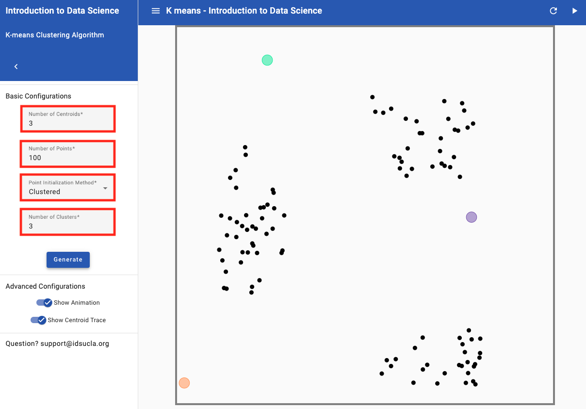
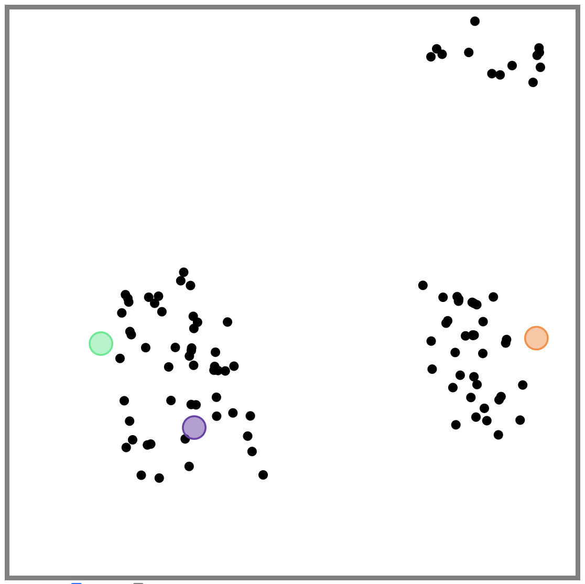
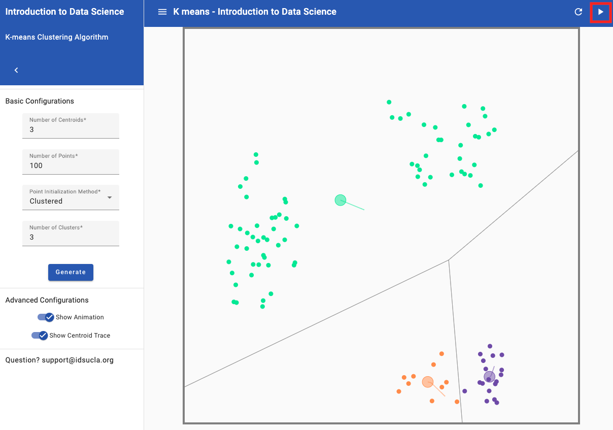

##***<u>Lesson 18: Where Do I Belong?</u>***

###**Objective:**
Students will learn what clustering is and how to classify groups of people into clusters based on unknown similarities.

###**Materials:**
1. *Find the Clusters* handout ([LMR_4.24_Find the Clusters](../IDS_Curriculum_v_5.0/2_IDS_LMRs_v_6.0/IDS_LMR_Unit 4_v_6.0/LMR_4.24_Find the Clusters.pdf))

###**Vocabulary:**
[clustering](../../vocabulary/unit4/#clustering "is the process of grouping a set of objects (or people) in such a way that objects (or people) in the same group are more similar to each other than those in other groups"){ .md-button }
[cluster](../../vocabulary/unit4/#cluster "a group of similar things or people positioned or occurring closely together"){ .md-button }
[k-means](../../vocabulary/unit4/#k-means "aims to partition data into k clusters in a way that data points in the same cluster are similar and data points in the different clusters are farther apart"){ .md-button }

###**Essential Concepts:**

!!! note "Essential Concepts: " 
    We can identify groups, or “clusters,” in data based on a few characteristics. For example, it is easy to classify a group of people into football players and swimmers, but what if you only knew each person’s arm span? How well could you classify them into football players and swimmers now?

###**Lesson:**
1. Inform the students that they will continue to explore different types of models, and today they will be focusing on **clustering**. Clustering is the process of grouping a set of objects (or people) together in such a way that people in the same group (called a **cluster**) are more similar to each other than to those in other groups.

2. Have the students recall that, in the previous lessons, they used decision trees/CART to classify people into different groups based on whether or not a person had a specific
characteristic (e.g., whether or not a professional athlete’s team is based in the US).

3. But, sometimes we don’t know what these specific characteristics are. We are simply given
numerical variables and asked to find similarities. This is where clustering comes in – similar people will congregate towards each other, and we want to see if we can identify their groupings.

4. We will look at a very basic example first. Suppose the following 6 observations are given:

    | **Obs** | **X1** | **X2** |
    |-----|---------------|---------------|
    | 1 | 160 | 74 |
    | 2 | 165 | 72 |
    | 3 | 165 | 74 |
    | 4 | 175 | 68 |
    | 5 | 180 | 70 |
    | 6 | 185 | 72 |

5. Plot the X1 and X2 points on a scatterplot either on the board or on poster paper (X1 can be on the horizontal axis and X2 can be on the vertical axis). The graph should look like the one below:

    

6. Ask students if they think there are any clusters, or groups, that stand out to them. It is likely that they will say there are 2 clusters in the graph: the top left corner 3 points, and the bottom right 3 points.

7. Now pose the following scenario that further describes the data:

    100. A doctor provides yearly physicals to the football and swimming teams at a local high school.

    100. The doctor has collected data over the past few years on each player’s weight (in pounds) and
    height (in inches). She informs us that weight was coded as the variable X1, and height was coded as the variable X2. You can re-label the scatterplot with this new information.

        

    100. Unfortunately, the doctor never recorded what sport each person played.

8. Using the information about height and weight, ask the students to decide:

    100. Which group of points most likely represents players from the swimming team? ***Answer: The points in the upper left corner are probably swimmers because swimmers are usually tall (and have large arm spans) and thin.***

    100. Which group of points most likely represents players from the football team? ***Answer: The points in the bottom right corner are probably football players because they tend to be heavier and more muscular.***

9. Now suppose a new player comes into the doctor’s office for a physical. His weight and height are recorded as 166 pounds and 73 inches, respectively, but the doctor forgets to ask what sport he plays. Plot this point on the graph and ask students to determine which sport they think this student plays. ***Answer: This student is most likely a swimmer because he is tall and thin, and his point is near the swimming cluster.***

10. That was an easy one! But what if a player comes in and has the following measurements: weight = 173 pounds, height = 73 inches?

11. Distribute the *Find the Clusters* handout ([LMR_4.24](../IDS_Curriculum_v_5.0/2_IDS_LMRs_v_6.0/IDS_LMR_Unit 4_v_6.0/LMR_4.24_Find the Clusters.pdf)) and tell the students that the new point has been added to the “Round 0” graph.
    
<iframe src="https://docs.google.com/viewerng/viewer?url=https://curriculum.idsucla.org/IDS_Curriculum_v_5.0/2_IDS_LMRs_v_6.0/IDS_LMR_Unit 4_v_6.0/LMR_4.24_Find the Clusters.pdf&embedded=true" style=" width:420px;height:400px;" frameborder="0"></iframe> [LMR_4.24](../IDS_Curriculum_v_5.0/2_IDS_LMRs_v_6.0/IDS_LMR_Unit 4_v_6.0/LMR_4.24_Find the Clusters.pdf)

12. Ask students:

    100. On which team do you think this person plays? ***Answer: It is much more difficult to tell now because it looks like it is right in between the two clusters.***

13. In order to determine group placement, we can use a process called **k-means clustering**. With this method, we select k clusters that we want to identify. Since we know we only have 2 types of athletes, football players and swimmers, we will be finding k = 2 clusters.

14. To introduce the students to this idea, circle the 3 points in the upper left corner (the ones that are likely the swimmers) and have students find the “mean point”. This means that they should find the mean x-value and the mean y-value of the 3 points. They can then plot this new point and use it as the mean of this particular group, or cluster.

15. The goal of this algorithm is to keep recalculating means as the clusters change. To begin, we will pick 2 points, A and B, to represent the center of each cluster. We will be referring to this as the initialization step. If you would like to use the point found in Step 14 and label it as "A", that is completely fine. You can simply pick just one other random point near the other cluster and label it as "B".

16. **<u>Initialization:</u>** For now, we will start with the following two points as our initial cluster centers of each group: A: (170, 70) and B: (175, 74). In the “Round 0” plot on the *Find the Clusters* handout, each student should plot and label these two points.

    

17. **<u>Assignment Step:</u>** Inform the students that they will be determining the distance between the 7 observations and point A and point B. Then, they will decide if the point is closer to cluster center A or cluster center B and label the point with that letter.

    100. Lines have been drawn from the top left point to the cluster centers in the plot below as a guide. You can draw this on the board as a reference for the students as well.

    
    
    100. Since the line to point A is smaller, we would classify that point as being in cluster A (as shown below).

    
    
    100. The students should draw similar lines for every point on the graph, or they can simply eyeball it, to make a decision as to which cluster each belongs in. Even if they guess incorrectly, the algorithm should be able to find the correct groups after some time. The correct classifications for Round 0 are as follows, using our points from step 16:

    

18. **<u>Update Step:</u>** Once the class has agreed on the Round 0's cluster classifications, they should compute new values for points A and B by using the clustered point means. For point A, they simply need to find the mean x-value for the 4 points and the mean y-value for the 4 points. Repeat this process to find the new point B – these will be our new cluster centers as we move onto Round 1. Calculating means to derive cluster centers, like points A and B, for grouping data points is part of the k-means algorithm.

    100. The new points for A and B have been calculated below. The students should be calculating these on their own and recording their new cluster centers on the handout.

    
x-value for A = (160 + 165 + 165 + 175)/4 = 166.25

    
y-value for A = (74 + 72 + 74 + 68)/4 = 72

    
x-value for B = (173 + 180 + 185)/3 = 179.3

    
y-value for B = (73 + 70 + 72)/3 = 71.67

    
new A = (166.25, 72)

    
new B = (179.3, 71.67)

19. Have the students continue working through the handout until the cluster membership remains the same between 2 consecutive rounds. This means that, from one iteration to the next, the points in each cluster do not change.

20. Where you choose your initial points matters in determining which points end up in which clusters. Demonstrate this to the class using the K-means Clustering App, located on the Applications page on Portal under Explore ([https://portal.idsucla.org/#curriculum/applications/](https://portal.idsucla.org/#curriculum/applications/ "https://portal.idsucla.org/#curriculum/applications/"){:target="_blank"}).

    100. In the app, "centroids" is the academic term for cluster centers. For this example, we will use 3 centroids and choose a "Clustered Initialization" with 100 points and 3 Clusters. See image below for how to adjust the settings.

    

    100. Move two of the centroids so that they are close to/within one cluster. An example is shown below.

    

    100. Click "Next Step" until no points change from the previous update. See image below of end of clustering for the example from (b).

    

    100. While we still have three clusters, we can clearly see that our initial points have influenced the end result of those clusters. You can move the centroids to the center of the clusters to illustrate this point (see image below of correctly clustered groups).

    

    **<u>Note:</u>** You can click "Re-Initialize Centroids" and it will move your cluster centers to new positions while still using the same 100 points. You can repeat the same process as in step (c) to discover different additonal groupings, although they may not be opimized as shown in step (d).

###**Class Scribes:**
One team of students will give a brief talk to discuss what they think the 3 most important topics of the day were.

###
**Homework & Next Day**

Write a paragraph that describes k-means clustering in your own words.

[<u>***LAB 4H: Finding Clusters***</u>](lab4h.md)

Complete [Lab 4H](lab4h.md) prior to [Lesson 21](lesson21.md).