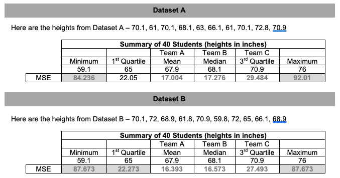
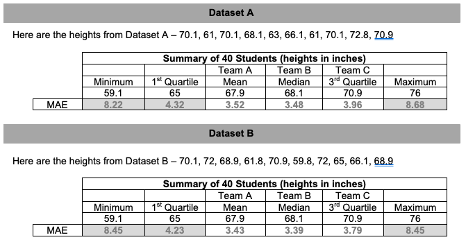

##***<u>Lesson 7: Statistical Predictions Applying the Rule</u>***

###**Objective:**
Students will apply the rule statisticians use to determine the best method for predicting heights for
students at a high school.

###**Materials:**
1. Each team’s rule for determining a winner (from previous lesson)

2. *A Tale of Two Rules* handout ([LMR_4.7_A Tale of Two Rules](../IDS_Curriculum_v_5.0/2_IDS_LMRs_v_6.0/IDS_LMR_Unit 4_v_6.0/LMR_4.7_A Tale of Two Rules.pdf))

3. *Prediction Games* handout ([LMR_4.8_Prediction Games](../IDS_Curriculum_v_5.0/2_IDS_LMRs_v_6.0/IDS_LMR_Unit 4_v_6.0/LMR_4.8_Prediction Games.pdf))

###**Vocabulary:**
[training data](../../vocabulary/unit4/#training-data "a random subset consisting of about 75-85% of the original dataset on which a model is trained"){ .md-button }
[testing data](../../vocabulary/unit4/#testing-data "a random subset consisting of about 15-25% of the original dataset on which a model is tested"){ .md-button }
[mean squared error](../../vocabulary/unit4/#mean-squared-error "tells you how close a regression line is to a set of points; is determined by finding the average of the squared differences between your guess and the actual values"){ .md-button }
[mean absolute error](../../vocabulary/unit4/#mean-absolute-error "the amount of error in your measurements; it is the difference between the measured value and the "true" value"){ .md-button }
[residual](../../vocabulary/unit4/#residual "the difference between our prediction and the actual outcome; also called an "error""){ .md-button }

###**Essential Concepts:**

!!! note "Essential Concepts: " 
    If we use the mean squared errors rule, then the mean of our current data is the best
    prediction of future values. If we use the mean absolute errors rule, then the median of the current data is the
    best prediction of future values.

###**Lesson:**
1. Ask students to recall that in the previous lesson, each student team created a rule to determine
a winner. Which team’s rules worked well for determining a winner?

2. Remind them that in their DS Journals, they took notes about each team’s rule as they presented.
This time, they will be switching roles – instead of creating a rule to judge the given predictions,
they will be given a rule and it’s their job to find the best prediction to win the contest.

3. Have students refer back to the *Heights of Students at a Large High School* handout (LMR_4.6) from the previous lesson. 

4. Recall that the student teams were provided with height data on 40 selected students to come up with their predictions for future observations. This is a common practice with statisticians and data scientists. The first dataset of 40 students is called the **training data** where we train a model to make predictions. Then we use the **testing data** (dataset A and dataset B) to test those predictions. Using the training data, the teams used different statistics for their predictions:

    100. Team A used the mean.

    100. Team B used the median.

    100. Team C used the third quartile.

5. In the previous lesson, you created your own rules to determine the winner. Today, you will learn rules that statisticians and data scientists use. The first is called the **mean squared error** rule.   **Note to teacher**: acknowledge any groups who came up with MSE or MAE on their own in the previous lesson.

6. An "*error*" is the difference between our prediction and the actual outcome and is sometimes called a "residual". The mean squared error is also called:

    100. Mean squared deviation

    100. Mean squared residual

    100. Residual sum of squares

    The formula looks like this, where  stands for the predicted value: 

    Using this formula, the teams' scores are determined by finding the average of the squared differences between their predictions and the actual values. The winner is the team with the lowest mean squared error.   

7. Let’s use R to do the heavy lifting for us. Demonstrate how to find the mean squared error by typing the following commands in the console (throughout the process, show what is happening in the Environment and the dataframe):

        #First, let's create a vector of the heights in our first dataset:
        height <- c(70.1, 61, 70.1, 68.1, 63, 66.1, 61, 70.1, 72.8, 70.9)
        
        #Next, convert this vector into a dataframe:
        datasetA <- data.frame(height)
        
        #Now we find the residuals using one of the statistics.
        #For this example, we'll use the first quartile from the training data (65 inches): 
        datasetA <- mutate(datasetA, residual=height-65)
        
        #Next, we will square each residual:
        datasetA <- mutate(datasetA, sq_res=residual^2)
        #Finally, we use the mean function to:
        #sum up the squared residuals and divide by 10 to find our mean squared deviation:
        mean(~sq_res, data=datasetA)
    
    This process gives us the mean squared error of 22.05.

    **<u>Note to teacher:</u>** The value of the mean squared error will always be in square units. In order to convert back to the original units, simply take the square root of the mean squared error.   Interpretation: When using the Q1 height to make predictions about all heights, our predictions will typically be off by  inches.

    Here is the vector of heights for Dataset B:

        heightB <- c(70.1, 72, 68.9, 61.8, 70.9, 59.8, 72, 65, 66.1, 68.9)

8. Distribute the *A Tale of Two Rules* handout ([LMR_4.7](../IDS_Curriculum_v_5.0/2_IDS_LMRs_v_6.0/IDS_LMR_Unit 4_v_6.0/LMR_4.7_A Tale of Two Rules.pdf)).
    
<iframe src="https://docs.google.com/viewerng/viewer?url=https://curriculum.idsucla.org/IDS_Curriculum_v_5.0/2_IDS_LMRs_v_6.0/IDS_LMR_Unit 4_v_6.0/LMR_4.7_A Tale of Two Rules.pdf&embedded=true" style=" width:420px;height:400px;" frameborder="0"></iframe> [LMR_4.7](../IDS_Curriculum_v_5.0/2_IDS_LMRs_v_6.0/IDS_LMR_Unit 4_v_6.0/LMR_4.7_A Tale of Two Rules.pdf)

9. Let's see how well our teams' predictions did on the heights of the testing data. Students will work in teams to answer: Using the mean squared errors, which statistic is the winner? Discuss which statistic made the best predictions in all three games.

    ***Answers:***

    

    **<u>Note to teacher:</u>** Explain that the mean/Team A was the winner of this contest. Data scientists (and
    mathematicians) can prove that the mean will **always** work best (except in a few weird cases
    from time to time). So if you want to predict the future, the mean is the best single guess you can
    make.

10. Ask: What if another data science class has a best rule that is different from ours?

11. Another agreed upon method that data scientists and statisticians often use is the **mean
absolute error**. It’s unlikely that students will figure this out on their own. The reasons why we do
it in statistics can be proven mathematically but it's beyond the scope of this course. The mean absolute error is expressed as (where <align></align> stands for the predicted value): 

12. Explain that each team will now use the statisticians’ method for declaring a winner. Display the
mean absolute error formula and discuss what each symbol means.

    Here is the script for MAE:
    
        #Find the absolute value of the residuals using one of the statistics
        #For this example, we'll use the first quartile from the training data (65 inches): 
        datasetA <- mutate(datasetA, residual=abs(heightA-65))

        #Finally, we use the mean function to:
        #sum up the residuals and divide by 10 to find our mean absolute error:
        mean(~residual, data=datasetA)

    This process gives us the mean absolute error of 4.32.

13. Using our previous examples, recalculate your predictions using the MAE.

14. Using the mean absolute error, which statistic/team is the winner?

    ***Answers:***

    

    **<u>Note to teacher:</u>** Explain that in this instance, the median/Team B is the “winner.” This means that the
    way you play the game depends on the rules of the game. If we used the mean squared error (MSE), play
    with the mean. If we use the mean absolute error (MAE), play with the median.

15. Optional practice: Students can practice finding the mean squared error and mean absolute error using the mean and median with the *Prediction Games* handout ([LMR_4.8](../IDS_Curriculum_v_5.0/2_IDS_LMRs_v_6.0/IDS_LMR_Unit 4_v_6.0/LMR_4.8_Prediction Games.pdf)). The LMR includes the five number summary if they were curious how the MSE and MAE for other statistics compare.
    
<iframe src="https://docs.google.com/viewerng/viewer?url=https://curriculum.idsucla.org/IDS_Curriculum_v_5.0/2_IDS_LMRs_v_6.0/IDS_LMR_Unit 4_v_6.0/LMR_4.8_Prediction Games.pdf&embedded=true" style=" width:420px;height:400px;" frameborder="0"></iframe> [LMR_4.8](../IDS_Curriculum_v_5.0/2_IDS_LMRs_v_6.0/IDS_LMR_Unit 4_v_6.0/LMR_4.8_Prediction Games.pdf)

###**Class Scribes:**
One team of students will give a brief talk to discuss what they think the 3 most important topics of the
day were.